## Lecture 2

### Gradient Descent

Gradient	descent	/	ascent		is	
guaranteed	to	find	the	
minimum	/	maximum	when	
the	function	has	a	single	
minimum	/	maximum	

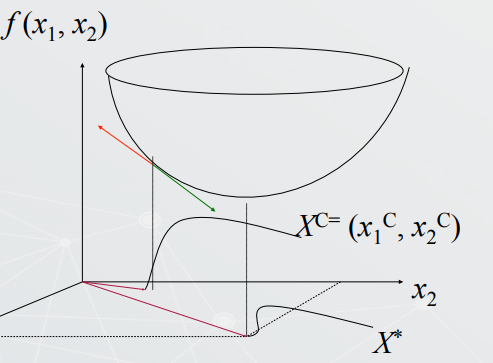


Deduce the GD algorithm:

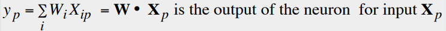


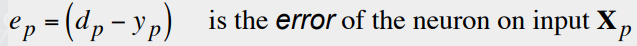


$$E = \frac{1}{2} \sum_p e_p^2$$


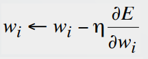


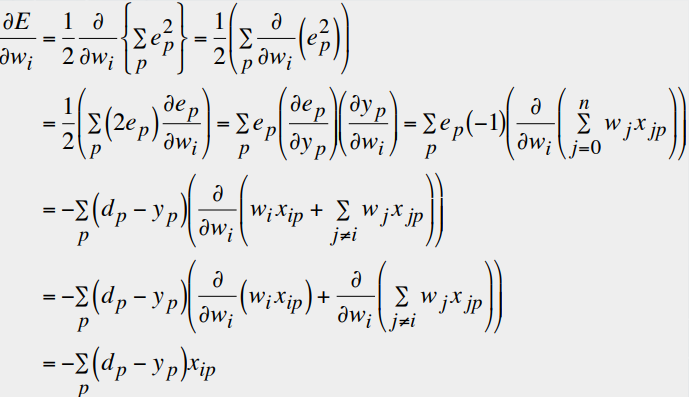


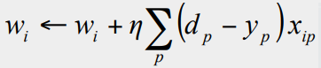


### Momentum

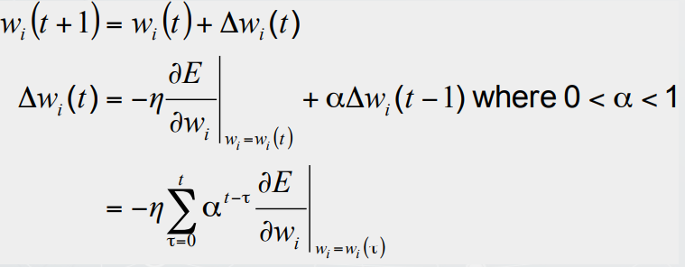


#### from cs229 notes:

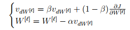

Notice how there are now two stages instead of a single stage. The relative importance is controlled by $\beta$.


```python
# Momentum update
v = mu * v - learning_rate * dx # integrate velocity
x += v # integrate position
```

### Locally weighted regression

> why use LWR (non-parametric algorithm)?

_In contrast, to
make predictions using locally weighted linear regression, we need to keep
the entire training set around._


_The term “non-parametric” (roughly) refers
to the fact that the amount of stuff we need to keep in order to represent the
hypothesis h grows linearly with the size of the training set._

----

- simple linear regression too easy to underfit
- polynomial regression too easy to overfit


Since the choice of
features is important to ensuring good performance of a learning algorithm

----

With the locally weighted linear regression (LWR) algorithm which, assuming
there is sufficient training data, makes the choice of features less critical

----

In the __original linear regression algorithm__, to make a prediction at a query
point x (i.e., to evaluate h(x)), we would:

- Fit $\theta$ to minimize $\Sigma_i (y^i - \theta^T x^{(i)})^2$
- Output $\theta^Tx$


In contrast, the locally weighted linear regression algorithm does the following:

- Fit $\theta$ to minimize $\Sigma_i w^{(i)}(y^i - \theta^T x^{(i)})^2$
- Output $\theta^Tx$


A fairly standard choice for the weights is:

$$w^{(i)} = \exp \left ( - \frac{(x^{(i)} - x)^2}{2 \tau ^2} \right )$$

-  The parameter
$\tau$ controls how quickly the weight of a training example falls off with distance
of its $x^{(i)}$ from the query point $x$;


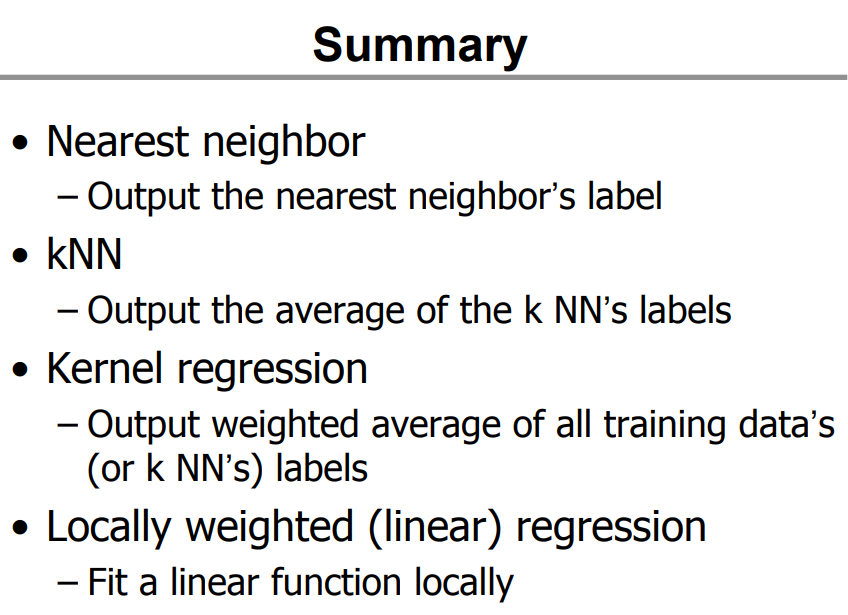


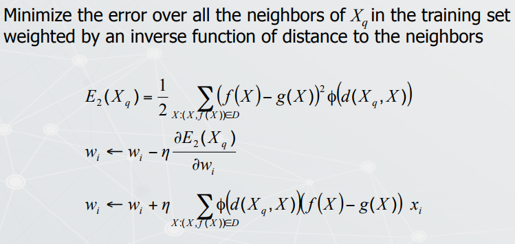

## Additional Notes

### LDA (Linear discriminant analysis)

`Fischer’s linear discriminant`

__The idea is to find the line that best separates the 2 classes__

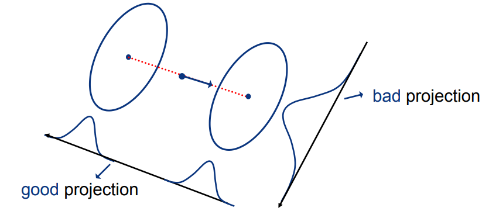

We have 2 classes that 

$$E_{X \mid Y} \left [ X \mid Y = i \right] = \mu_i$$

$$E_{X \mid Y} \left [ (X-\mu_i)(X-\mu_i)^T \mid Y = i \right] = \Sigma_i$$

And our goal is to find the line 

$$z = w^Tx$$

that best separates them

one possibility would be to maximize:

$$(E_{Z \mid Y} \left [ Z \mid Y = 1 \right] - E_{Z \mid Y} \left [ Z \mid Y = 0 \right])^2=$$

$$E_{X \mid Y} \left [ w^T x \mid Y = 1 \right] - E_{X \mid Y} \left [ w^T x \mid Y = 0 \right]$$

$$=(w^T \left [ \mu_1 - \mu_0 \right])^2$$

however, the method above could be made arbitrarily large by simply scaling w, so we need some type of normalization

__Fischer suggested:__

$$\max_w \frac{(E_{Z \mid Y} \left [ Z \mid Y = 1 \right]- E_{Z \mid Y} \left [ Z \mid Y = 0 \right])^2}{Var\left [ Z \mid Y = 1 \right] + Var\left [ Z \mid Y = 0 \right]}$$


So
$$J(w) = \frac{(E_{Z \mid Y} \left [ Z \mid Y = 1 \right]- E_{Z \mid Y} \left [ Z \mid Y = 0 \right])^2}{Var\left [ Z \mid Y = 1 \right] + Var\left [ Z \mid Y = 0 \right]}$$

$$J(w) = \frac{w^T ( \mu_1 - \mu_0 ) ( \mu_1 - \mu_0 )^T w}{w^T (\Sigma_1 + \Sigma_0) w} = \frac{w^T S_B w}{w^T S_W w}$$

where:

- between class scatter:
$$S_B = (\mu_1 - \mu_0)(\mu_1 - \mu_0)^T$$

- within class scatter:
$$S_W = (\Sigma_1 + \Sigma_0)$$


maximizing the ratio


$$J(w) = \frac{w^T S_B w}{w^T S_W w}$$


is equivalent to 
- maximizing the numerator 
- keeping the denominator constant

$$\max w^T S_B w $$ subject to 
$$w^T S_W w = K$$

Can be accomplished using Larange multipliers

define the Lagrangian

$$L = w^T S_B w - \lambda (w^T S_w w - K)$$


and maximize wirh respect to both w and $\lambda$


$$L = w^T (S_B - \lambda S_w) w + \lambda K$$


with respect to w to 0 we get

$$\triangledown_w L = 2(S_B - \lambda S_w)w = 0$$


so 

$$S_B w = \lambda S_w w$$


$$S_w ^{-1} S_B w = \lambda w$$

$$S_w ^{-1}  (\mu_1 - \mu_0)(\mu_1 - \mu_0)^T  w = \lambda w$$

$$w^* = S_w ^{-1}  (\mu_1 - \mu_0) = (\Sigma_1 + \Sigma_0) ^{-1}  (\mu_1 - \mu_0)$$


for a classification problem with Gaussian classes of equal cov $\Sigma_i = \Sigma$, the BDR boundary is the plane of normal

$$w = \Sigma^{-1} (\mu_i - \mu_j)$$


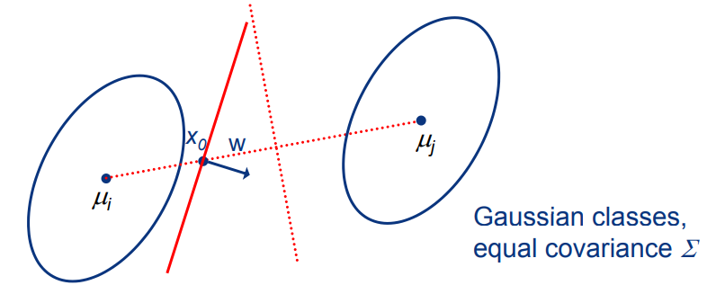

----

### Takeaways:

- it is optimal if and only if the classes are Gaussian and have optimal if and only if the classes are Gaussian and have
equal covariance
- better than PCA, but not necessarily good enough
- a classifier on the LDA feature, is equivalent to
     - the BDR after the approximation of the data by two Gaussians with equal covariance
     
     

### LDA code


```python
import numpy as np
from utils.util import cal_covariance_matrix, train_test_split, accuracy_score
from sklearn.datasets import load_iris
import matplotlib.pyplot as plt


class LDA(object):
    def __init__(self):
        self.w = None

    def fit(self, X, y):
        X1 = X[y == 0]
        X2 = X[y == 1]

        cov1 = cal_covariance_matrix(X1)
        cov2 = cal_covariance_matrix(X2)
        cov_tot = cov1 + cov2

        mean1 = X1.mean(0)
        mean2 = X2.mean(0)
        mean_diff = np.atleast_1d(mean1 - mean2)

        # Determine the vector which when X is projected onto it best separates the
        # data by class. w = (mean1 - mean2) / (cov1 + cov2)
        self.w = np.linalg.pinv(cov_tot).dot(mean_diff)

    def transform(self, X, y):
        self.fit(X, y)
        X_transform = X.dot(self.w)
        return X_transform

    def predict(self, X):
        y_pred = []
        for sample in X:
            h = sample.dot(self.w)
            y = 1 * (h < 0)
            y_pred.append(y)
        return y_pred


def main():
    data = load_iris()
    X = data.data
    y = data.target

    X = X[y != 2]
    y = y[y != 2]

    X_train, X_test, y_train, y_test = train_test_split(X, y, test_size=0.3)

    lda = LDA()
    lda.fit(X_train, y_train)
    y_pred = lda.predict(X_test)

    accuracy = accuracy_score(y_test, y_pred)

    print("Accuracy:", accuracy)

    plt.plot(X_test, y_pred)
    plt.title('LDA')
    plt.show()

if __name__ == "__main__":
    main()
```


## Lab

### In class


```python
from sklearn import datasets, linear_model
from sklearn.neighbors import KNeighborsRegressor

'''Import the Diabetes dataset'''
diabetes = datasets.load_diabetes()

'''Info about the dataset'''
print('The matrix is of the following shape:', diabetes.data.shape)
print('The label vector is of the following shape: ', diabetes.target.shape)

'''See what it looks like'''
print('The feature matrix:\n',diabetes.data)
print('The labels:\n',diabetes.target)

'''The regressor'''
my_regressor = linear_model.LinearRegression()

'''Note: we have not taught systematic training yet, consider this as a simple example.
    Later in the semester, we will learn how to properly train the machine learning models.
'''
train_data = diabetes.data
train_labels = diabetes.target
my_regressor.fit(train_data, train_labels) # train the classifier

test_sample = [[0.011, 0.043, 0.056, 0.081, 0.075, 0.064, 0.053, 0.015, 0.023, 0.076]]

'''Testing phase:'''
print('Prediction of regression on the test sample:', my_regressor.predict(test_sample))

'''Locally weighted regression'''
my_knn_regressor = KNeighborsRegressor(n_neighbors = 3)# 3 neighbors chosen arbitrarily
my_knn_regressor.fit(train_data, train_labels) # train the local regressor
print('Prediction using local regression:', my_knn_regressor.predict(test_sample))
```

    The matrix is of the following shape: (442, 10)
    The label vector is of the following shape:  (442,)
    The feature matrix:
     [[ 0.03807591  0.05068012  0.06169621 ... -0.00259226  0.01990842
      -0.01764613]
     [-0.00188202 -0.04464164 -0.05147406 ... -0.03949338 -0.06832974
      -0.09220405]
     [ 0.08529891  0.05068012  0.04445121 ... -0.00259226  0.00286377
      -0.02593034]
     ...
     [ 0.04170844  0.05068012 -0.01590626 ... -0.01107952 -0.04687948
       0.01549073]
     [-0.04547248 -0.04464164  0.03906215 ...  0.02655962  0.04452837
      -0.02593034]
     [-0.04547248 -0.04464164 -0.0730303  ... -0.03949338 -0.00421986
       0.00306441]]
    The labels:
     [151.  75. 141. 206. 135.  97. 138.  63. 110. 310. 101.  69. 179. 185.
     118. 171. 166. 144.  97. 168.  68.  49.  68. 245. 184. 202. 137.  85.
     131. 283. 129.  59. 341.  87.  65. 102. 265. 276. 252.  90. 100.  55.
      61.  92. 259.  53. 190. 142.  75. 142. 155. 225.  59. 104. 182. 128.
      52.  37. 170. 170.  61. 144.  52. 128.  71. 163. 150.  97. 160. 178.
      48. 270. 202. 111.  85.  42. 170. 200. 252. 113. 143.  51.  52. 210.
      65. 141.  55. 134.  42. 111.  98. 164.  48.  96.  90. 162. 150. 279.
      92.  83. 128. 102. 302. 198.  95.  53. 134. 144. 232.  81. 104.  59.
     246. 297. 258. 229. 275. 281. 179. 200. 200. 173. 180.  84. 121. 161.
      99. 109. 115. 268. 274. 158. 107.  83. 103. 272.  85. 280. 336. 281.
     118. 317. 235.  60. 174. 259. 178. 128.  96. 126. 288.  88. 292.  71.
     197. 186.  25.  84.  96. 195.  53. 217. 172. 131. 214.  59.  70. 220.
     268. 152.  47.  74. 295. 101. 151. 127. 237. 225.  81. 151. 107.  64.
     138. 185. 265. 101. 137. 143. 141.  79. 292. 178.  91. 116.  86. 122.
      72. 129. 142.  90. 158.  39. 196. 222. 277.  99. 196. 202. 155.  77.
     191.  70.  73.  49.  65. 263. 248. 296. 214. 185.  78.  93. 252. 150.
      77. 208.  77. 108. 160.  53. 220. 154. 259.  90. 246. 124.  67.  72.
     257. 262. 275. 177.  71.  47. 187. 125.  78.  51. 258. 215. 303. 243.
      91. 150. 310. 153. 346.  63.  89.  50.  39. 103. 308. 116. 145.  74.
      45. 115. 264.  87. 202. 127. 182. 241.  66.  94. 283.  64. 102. 200.
     265.  94. 230. 181. 156. 233.  60. 219.  80.  68. 332. 248.  84. 200.
      55.  85.  89.  31. 129.  83. 275.  65. 198. 236. 253. 124.  44. 172.
     114. 142. 109. 180. 144. 163. 147.  97. 220. 190. 109. 191. 122. 230.
     242. 248. 249. 192. 131. 237.  78. 135. 244. 199. 270. 164.  72.  96.
     306.  91. 214.  95. 216. 263. 178. 113. 200. 139. 139.  88. 148.  88.
     243.  71.  77. 109. 272.  60.  54. 221.  90. 311. 281. 182. 321.  58.
     262. 206. 233. 242. 123. 167.  63. 197.  71. 168. 140. 217. 121. 235.
     245.  40.  52. 104. 132.  88.  69. 219.  72. 201. 110.  51. 277.  63.
     118.  69. 273. 258.  43. 198. 242. 232. 175.  93. 168. 275. 293. 281.
      72. 140. 189. 181. 209. 136. 261. 113. 131. 174. 257.  55.  84.  42.
     146. 212. 233.  91. 111. 152. 120.  67. 310.  94. 183.  66. 173.  72.
      49.  64.  48. 178. 104. 132. 220.  57.]
    Prediction of regression on the test sample: [198.62598197]
    Prediction using local regression: [137.66666667]


### Reorganized


```python
import numpy as np
from sklearn import datasets, linear_model
from sklearn.neighbors import KNeighborsRegressor
from sklearn.model_selection import train_test_split
import matplotlib.pyplot as plt
from sklearn.metrics import mean_absolute_error, mean_squared_error, mean_squared_log_error


def load_dataset(all_features=True, dim=2):
    diabetes = datasets.load_diabetes()
    y = diabetes.target
    if all_features:
        X = diabetes.data
    else:
        X = diabetes.data[:, np.newaxis, dim]
    return X, y


def split_dataset(X, y):
    X_train, X_test, y_train, y_test = train_test_split(X, y, test_size=0.2)
    return X_train, X_test, y_train, y_test


def plot_scatter(X_train, y_train, X_test, y_test):
    cmap = plt.get_cmap('viridis')
    m1 = plt.scatter(x=X_train, y=y_train, color=cmap(0.9), s=10)
    m2 = plt.scatter(x=X_test, y=y_test, color=cmap(0.5), s=10)
    plt.legend((m1, m2), ("Training data", "Test data"), loc='lower right')
    return plt


class Regression(object):
    def __init__(self, X_train, X_test, y_train, y_test):
        self.X_train = X_train
        self.X_test = X_test
        self.y_train = y_train
        self.y_test = y_test
        self.regression_model = None

    def fit(self):
        self.regression_model.fit(self.X_train, self.y_train)

    def predict(self):
        return self.regression_model.predict(self.X_test)

    def loss(self, y_real, y_pred, metric):
        if metric == 'mse':
            error = mean_squared_error(y_true=y_real, y_pred=y_pred)
        elif metric == 'mse_log':
            error = mean_squared_log_error(y_true=y_real, y_pred=y_pred)
        elif metric == 'mse_abs':
            error = mean_absolute_error(y_true=y_real, y_pred=y_pred)
        return error

    def plot_line(self, X, y_pred, plt, error, metric):
        return NotImplemented


class LinearRegression(Regression):
    def __init__(self, X_train, X_test, y_train, y_test):
        super(LinearRegression, self).__init__(X_train, X_test, y_train, y_test)
        self.regression_model = linear_model.LinearRegression()

    def fit(self):
        super(LinearRegression, self).fit()

    def predict(self):
        return super(LinearRegression, self).predict()

    def plot_line(self, X, y_pred, plt, error, metric):
        plt.plot(X,
                 y_pred,
                 color='black',
                 linewidth=2,
                 label="Prediction")
        plt.title("linear-" + metric + ": {0:.7g}\n".format(error), fontsize=10)


class KNNRegression(Regression):
    def __init__(self, X_train, X_test, y_train, y_test,
                 dist='euclidean',
                 neighbors=20,
                 weights='uniform',
                 algorithm='auto'):
        super(KNNRegression, self).__init__(X_train, X_test, y_train, y_test)
        self.dist = dist
        self.neighbors = neighbors
        self.weights = weights
        self.algorithm = algorithm
        self.regression_model = KNeighborsRegressor(n_neighbors=self.neighbors,
                                                    weights=self.weights,
                                                    algorithm=self.algorithm,
                                                    metric=self.dist)

    def fit(self):
        super(KNNRegression, self).fit()

    def predict(self):
        return super(KNNRegression, self).predict()

    def plot_line(self, X, y_pred, plt, error, metric):
        plt.plot(X,
                 y_pred,
                 color='red',
                 linewidth=0.1,
                 label="Prediction")
        plt.title("knn-" + metric + ": {0:.7g}\n".format(error), fontsize=10)


def grid_search_comparison(lr_err, y_test, metric='mse', neighbors=200):
    kr_errs = []
    for neighbor in range(3, neighbors):
        kr = KNNRegression(neighbors=neighbor)
        kr.fit()
        y_pred = kr.predict()
        kr_err = kr.loss(y_real=y_test, y_pred=y_pred, metric=metric)
        kr_errs.append(kr_err)

    fig = plt.figure(figsize=(8, 8))
    plt.plot(range(3, neighbors), kr_errs)
    plt.hlines(lr_err, xmin=1, xmax=neighbors, colors='red')
    plt.title('Loss: {} Neighbors: {}'.format(metric, neighbors))
    return fig


def test_all_features():
    metric = ['mse', 'mse_log', 'mse_abs']
    X, y = load_dataset()
    X_train, X_test, y_train, y_test = split_dataset(X, y)

    lr = LinearRegression()
    lr.fit()
    lr_y_pred = lr.predict()

    lr_mse = lr.loss(y_real=y_test, y_pred=lr_y_pred, metric=metric[0])
    lr_mse_log = lr.loss(y_real=y_test, y_pred=lr_y_pred, metric=metric[1])
    lr_mse_abs = lr.loss(y_real=y_test, y_pred=lr_y_pred, metric=metric[2])
    lr_err = [lr_mse, lr_mse_log, lr_mse_abs]

    for idx, m in enumerate(metric):
        fig = grid_search_comparison(lr_err=lr_err[idx], y_test=y_test, metric=m)
        fig.savefig(fname='plots/{}.png'.format(m))


def test_single_feature():
    n_features = 10
    metric = ['mse', 'mse_log', 'mse_abs']

    for d in range(2, n_features):
        fig = plt.figure(figsize=(8, 8))

        X, y = load_dataset(all_features=False, dim=d)
        X_train, X_test, y_train, y_test = split_dataset(X, y)
        plt_ = plot_scatter(X_train=X_train,
                            X_test=X_test,
                            y_train=y_train,
                            y_test=y_test)

        lr = LinearRegression(X_train, X_test, y_train, y_test)
        lr.fit()
        lr_y_pred = lr.predict()

        kr = KNNRegression(X_train, X_test, y_train, y_test, neighbors=20)
        kr.fit()
        kr_y_pred = kr.predict()

        for me in metric:
            lr_err = lr.loss(y_real=y_test, y_pred=lr_y_pred, metric=me)
            kr_err = kr.loss(y_real=y_test, y_pred=kr_y_pred, metric=me)
            lr.plot_line(X=X_test, y_pred=lr_y_pred, plt=plt_, metric=me, error=lr_err)
            kr.plot_line(X=X_test, y_pred=kr_y_pred, plt=plt_, metric=me, error=kr_err)
            fig.savefig(fname='out_pred_plots/' + me + '-feature{}.png'.format(d))


if __name__ == '__main__':
    test_single_feature()
    test_all_features()

```
