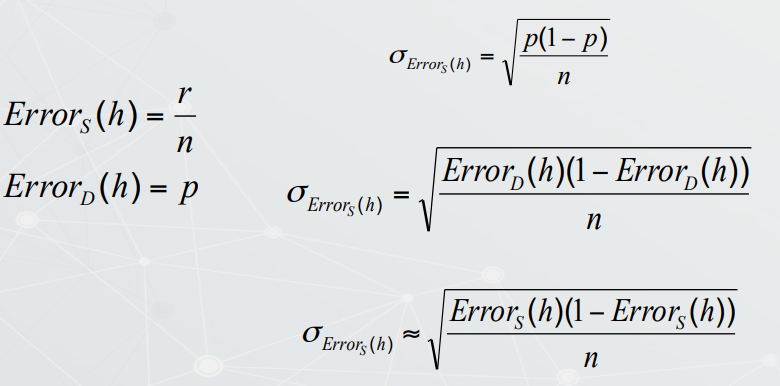
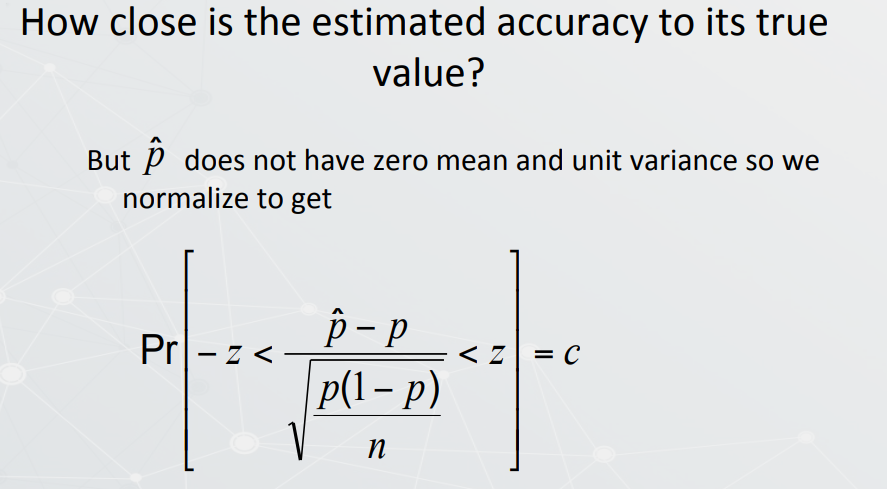
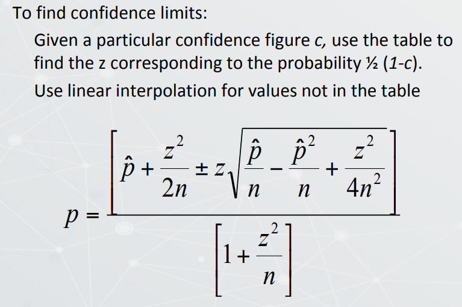

## Performance Measurement

### Classification Metrics

- Accuracy, Precision, Recall

> Takeaways:

- Accuracy: 

$$\frac{correct \: pred}{all \: pred}$$

- Precision

$$\frac{correct \: pos \: pred}{all \: pos \: pred}$$

- Recall

$$\frac{correct \: pos \: pred}{all \: actual \: pos}$$

#### Measuring Performance - Correlation Coefficient

$$CC_j = \frac{(TP_j x TN_j) - (FP_j x FN_j)}{\sqrt{(TP_j +FN_j)(TP_j +FP_j)(TN_j +FP_j)(TN_j +FP_j)}}$$

$$-1 \le CC_j\le 1$$

$$CC_j = \sum_{d_i \in D} \frac{(jlabel_i - \bar{jlabel})(jclass_i - \bar{jclass})}{\sigma_{jlabel} \sigma_{jclass}}$$

#### Avgerage Measurement

$$avg \: precision = \frac{\sum_j TP_j}{\sum_j TP_j + \sum FP_j}$$

$$avg \: recall = \frac{\sum_j TP_j}{\sum_j TP_j + \sum FN_j}$$

$$Avg \: Flase \: Alarm = 1-avg \: precision $$

$$CC = \frac{(\sum_j TP_j x \sum_j TN_j) - (\sum_j FP_j x \sum_j FN_j)}{\sqrt{(\sum_j TP_j + \sum_j FN_j)(\sum_j TP_j +\sum_j FP_j)(\sum_j TN_j + \sum_j FP_j)(\sum_j TN_j + \sum_j FP_j)}}$$

$$-1 \le CC_j\le 1$$

####  ROC and AUC Curve

### Evaluating the performance of a classifier

Sample error estimated from training data is an optimistic estimate

$$Bias = E[Error_S(h)] - Error_D(h)$$

For an unbiased estimate, h must be evaluated on an independent sample S (S is not i the training set)

Even	when	the	estimate	is	unbiased,	it	can	vary	across	samples

$$Error_D (h)= Pr[f (x) \neq h(x)]$$

$$Error_S(h) = \frac{1}{S} \sum \delta(f(x) \neq h(x))$$

where

$$\delta(f(x), h(x))=1 if f(x) \neq h(x) \delta(f(x), h(x)) =0 if \: otherwise$$

#### Binomial Distribution

$${\displaystyle f(k;n,p)=\Pr(X=k)={n \choose k}p^{k}(1-p)^{n-k}}$$

$$\operatorname {E} [X]=np$$

$$\operatorname {Var} [X]=np(1-p)$$

- for Bernoulli trials:

The	mean	of	a	Bernoulli	trial	with	success	rate		=	p

Variance	=	p	(1-p)	

If	N	trials	are	taken	from	the	same Bernoulli	process,	the	
observed	success	rate $\hat p$ has the same mean $p$ and	variance	 $\frac{p(1-p)}{N}$

For	large	$N$,	the	distribution $\hat p$	of						follows	a	__Gaussian	distribution__

### Normal distribution

$${\displaystyle f(x\mid \mu ,\sigma ^{2})={\frac {1}{\sqrt {2\pi \sigma ^{2}}}}e^{-{\frac {(x-\mu )^{2}}{2\sigma ^{2}}}}}$$

