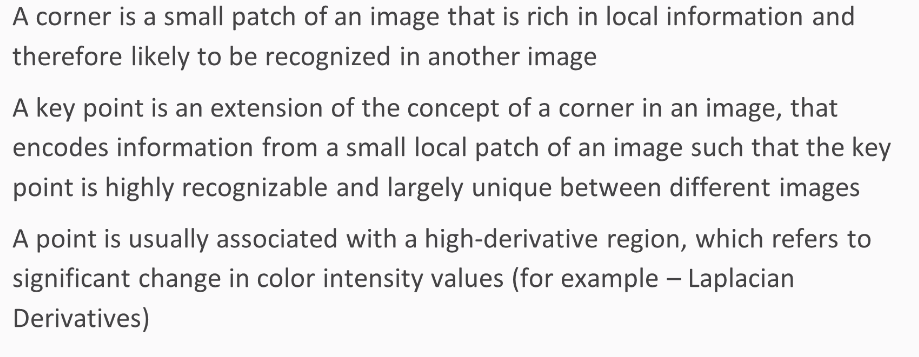
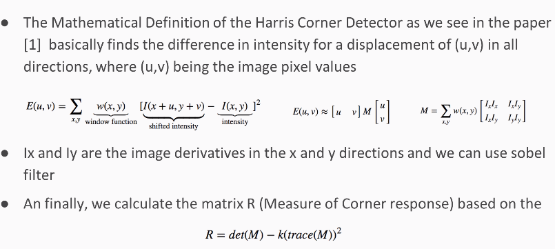
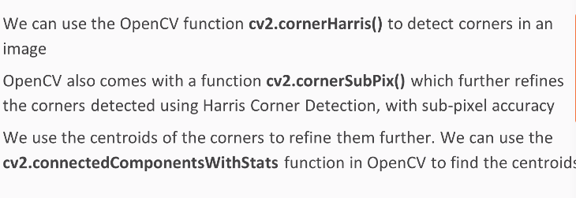

```python
# Checking the environment
import sys
import cv2
import os
import numpy as np
```




### Implementing Harris Corner Detection from Scratch


```python
import os
import numpy as np
import cv2
import matplotlib.pyplot as plt
import matplotlib.image as mpimg

%matplotlib inline
plt.rcParams['figure.figsize']=(16,8)

def findCorners(img, window_size=5, k=0.04, thresh=10000):
    """
    Finds and returns list of corners and new image with corners drawn
    :param img: The original image
    :param window_size: The size (side length) of the sliding window
    :param k: Harris corner constant. Usually 0.04 - 0.06
    :param thresh: The threshold above which a corner is counted
    :return:
    """
    
    #Find x and y derivatives
    dy, dx = np.gradient(img)
    Ixx = dx**2
    Ixy = dy*dx
    Iyy = dy**2
    height = img.shape[0]
    width = img.shape[1]
    
    newImg = img.copy()
    color_img = cv2.cvtColor(newImg, cv2.COLOR_GRAY2RGB)
    offset = int(window_size/2)

    #Loop through image and find the corners
    for y in range(offset, height-offset):
        for x in range(offset, width-offset):
            windowIxx = Ixx[y-offset:y+offset+1, x-offset:x+offset+1]
            windowIxy = Ixy[y-offset:y+offset+1, x-offset:x+offset+1]
            windowIyy = Iyy[y-offset:y+offset+1, x-offset:x+offset+1]
            Sxx = windowIxx.sum()
            Sxy = windowIxy.sum()
            Syy = windowIyy.sum()

            #Find determinant and trace, use to get corner response
            det = (Sxx * Syy) - (Sxy**2)
            trace = Sxx + Syy
            R = det - k*(trace**2)

            #If corner response is over threshold, color the point
            if R > thresh:
                color_img.itemset((y, x, 0), 0)
                color_img.itemset((y, x, 1), 0)
                color_img.itemset((y, x, 2), 255)
    return color_img

IMG = os.path.join("../","images","newleaf.jpg")

img = mpimg.imread(IMG)
gray = cv2.cvtColor(img, cv2.COLOR_RGB2GRAY)

res = findCorners(gray, 20, 0.2, 10000)

plt.subplot(121)
plt.title("Original Image")
plt.xticks([]), plt.yticks([])
plt.imshow(img)

plt.subplot(122)
plt.title("Corner Image")
plt.xticks([]), plt.yticks([])
plt.imshow(res)

plt.show()
```


### Corner Detection using Harris-Shi-Tomasi Feature Detector 


```python
img = mpimg.imread(IMG)
copy = img.copy()

gray = cv2.cvtColor(img,cv2.COLOR_BGR2GRAY)

corners = cv2.goodFeaturesToTrack(gray,25,0.01,10)
corners = np.int0(corners)

for i in corners:
    x,y = i.ravel()
    cv2.circle(copy,(x,y),3,255,-1)


plt.subplot(121)
plt.title("Original Image")
plt.xticks([]), plt.yticks([])
plt.imshow(img)

plt.subplot(122)
plt.title("Corner Image")
plt.xticks([]), plt.yticks([])
plt.imshow(copy)

plt.show()
```


### Harris Corner Detection using OpenCV


```python
# using cv2.cornerHarris()  

img = mpimg.imread(IMG)
copy = img.copy()

gray = cv2.cvtColor(img,cv2.COLOR_BGR2GRAY)

gray = np.float32(gray)
dst = cv2.cornerHarris(gray,2,3,0.04)

#result is dilated for marking the corners, not important
dst = cv2.dilate(dst,None)

# Threshold for an optimal value, it may vary depending on the image.
copy[dst>0.01*dst.max()]=[0,0,255]

plt.subplot(121)
plt.title("Original Image")
plt.xticks([]), plt.yticks([])
plt.imshow(img)

plt.subplot(122)
plt.title("Corner Image")
plt.xticks([]), plt.yticks([])
plt.imshow(copy)

plt.show()
```


### Harris Corner Detection using OpenCV with Sub-Pixel Accuracy




```python
# using cv2.cornerSubPix()  & cv2.connectedComponentsWithStats

IMG = os.path.join("../","images","leaf.jpg")
img = mpimg.imread(IMG)
copy = img.copy()

gray = cv2.cvtColor(img,cv2.COLOR_BGR2GRAY)

# find Harris corners
gray = np.float32(gray)
dst = cv2.cornerHarris(gray,2,3,0.04)
dst = cv2.dilate(dst,None)
ret, dst = cv2.threshold(dst,0.01*dst.max(),255,0)
dst = np.uint8(dst)

# find centroids
ret, labels, stats, centroids = cv2.connectedComponentsWithStats(dst)

# define the criteria to stop and refine the corners
criteria = (cv2.TERM_CRITERIA_EPS + cv2.TERM_CRITERIA_MAX_ITER, 100, 0.001)
corners = cv2.cornerSubPix(gray,np.float32(centroids),(5,5),(-1,-1),criteria)

# Now draw:
# the blue points are really small use cv2.circle to make them visible
res = np.hstack((centroids,corners))
res = np.int0(res)

# assign the transformation to copy image
copy[res[:,1],res[:,0]]=[0,0,255]
copy[res[:,3],res[:,2]] = [0,255,0]


plt.subplot(121)
plt.title("Original Image")
plt.xticks([]), plt.yticks([])
plt.imshow(img)

plt.subplot(122)
plt.title("Corner Image")
plt.xticks([]), plt.yticks([])
plt.imshow(copy)

plt.show()
```


### SIFT - Scale Invariant Feature Transform Example


```python
plt.rcParams['figure.figsize']=(16,8)

IMG = os.path.join("../","images","newleaf.jpg")
img = mpimg.imread(IMG)
copy = img.copy()

gray= cv2.cvtColor(img,cv2.COLOR_BGR2GRAY)
sift = cv2.xfeatures2d.SIFT_create()

kp = sift.detect(gray,None)

cv2.drawKeypoints(copy,kp,copy,flags=cv2.DRAW_MATCHES_FLAGS_DRAW_RICH_KEYPOINTS)

plt.figure("SIFT Features")

plt.subplot(121)
plt.title("Original Image")
plt.xticks([]), plt.yticks([])
plt.imshow(img)

plt.subplot(122)
plt.title("SIFT Features Image")
plt.xticks([]), plt.yticks([])
plt.imshow(copy)

plt.show()
```

    Time taken for detecting keypoints using SIFT  0.562652587890625  seconds


### SURF - Speed-Up Robust Features


```python
IMG = os.path.join("../","images","newleaf.jpg")
img = mpimg.imread(IMG)
copy = img.copy()

# Create SURF object. You can specify params here or later.
# Here set Hessian Threshold to 1000
surf = cv2.xfeatures2d.SURF_create(5000)

# Find keypoints and descriptors directly

kp, des = surf.detectAndCompute(img,None)

cv2.drawKeypoints(copy,kp,copy, flags=cv2.DRAW_MATCHES_FLAGS_DRAW_RICH_KEYPOINTS)

plt.figure("SURF Features")

plt.subplot(121)
plt.title("Original Image")
plt.xticks([]), plt.yticks([])
plt.imshow(img)

plt.subplot(122)
plt.title("SURF Features Image")
plt.xticks([]), plt.yticks([])
plt.imshow(copy)

plt.show()
```


### FAST - Features from Accelerated Segment Test


```python
IMG = os.path.join("../","images","newleaf.jpg")
img = mpimg.imread(IMG)

# Initiate FAST object with default values
fast = cv2.FastFeatureDetector_create()

# find and draw the keypoints
kp = fast.detect(img,None)

img2 = cv2.drawKeypoints(img, kp, None, flags=cv2.DRAW_MATCHES_FLAGS_DRAW_RICH_KEYPOINTS)

# Print all default params
print("Threshold: ", fast.getThreshold())
print("nonmaxSuppression: ", fast.getNonmaxSuppression())
print("neighborhood: ", fast.getType())
print("Total Keypoints with nonmaxSuppression: ", len(kp))

```

    Threshold:  10
    nonmaxSuppression:  True
    neighborhood:  2
    Total Keypoints with nonmaxSuppression:  7888


```python
plt.rcParams['figure.figsize']=(16,16)

# Disable nonmaxSuppression
fast.setNonmaxSuppression(0)
kp = fast.detect(img,None)
print("Total Keypoints without nonmaxSuppression: ", len(kp))

img3 = cv2.drawKeypoints(img, kp, None, flags=cv2.DRAW_MATCHES_FLAGS_DRAW_RICH_KEYPOINTS)

plt.figure("FAST Features",figsize=(8,8))

plt.subplot(311)
plt.title("Original Image")
plt.xticks([]), plt.yticks([])
plt.imshow(img)

plt.subplot(312)
plt.title("FAST Features with Non-Max Supression")
plt.xticks([]), plt.yticks([])
plt.imshow(img2)

plt.subplot(313)
plt.title("FAST Features without Non-Max Supression")
plt.xticks([]), plt.yticks([])
plt.imshow(img3)

plt.show()
```

    Total Keypoints without nonmaxSuppression:  17513


### BRIEF - Binary Robust Independent Elementary Features


```python
IMG = os.path.join("../","images","newleaf.jpg")
img = mpimg.imread(IMG)

# Making a copy of the original image
copy = img.copy()

# Initiate FAST detector
star = cv2.xfeatures2d.StarDetector_create()

# Initiate BRIEF extractor
brief = cv2.xfeatures2d.BriefDescriptorExtractor_create()

# find the keypoints with STAR
kp = star.detect(img,None)

# compute the descriptors with BRIEF
kp, des = brief.compute(img, kp)

print("Descriptor Size : ", brief.descriptorSize())
print("Descriptor Shape : ", des.shape)

cv2.drawKeypoints(copy,kp,copy,flags=cv2.DRAW_MATCHES_FLAGS_DRAW_RICH_KEYPOINTS)

plt.figure("BRIEF Features")

plt.subplot(121)
plt.title("Original Image")
plt.xticks([]), plt.yticks([])
plt.imshow(img)

plt.subplot(122)
plt.title("BRIEF Features Image")
plt.xticks([]), plt.yticks([])
plt.imshow(copy)

plt.show()
```

    Descriptor Size :  32
    Descriptor Shape :  (190, 32)


### ORB - Oriented FAST and Rotated BRIEF


```python
plt.rcParams['figure.figsize']=(16,8)

IMG = os.path.join("../","images","newleaf.jpg")
img = mpimg.imread(IMG)

copy = img.copy()

# Initiate ORB detector
orb = cv2.ORB_create()

# find the keypoints with ORB
kp = orb.detect(img,None)

# compute the descriptors with ORB
kp, des = orb.compute(img, kp)

# draw only keypoints location,not size and orientation
cv2.drawKeypoints(img, kp, copy, flags=cv2.DRAW_MATCHES_FLAGS_DRAW_RICH_KEYPOINTS)

plt.subplot(121)
plt.title("Original Image")
plt.xticks([]), plt.yticks([])
plt.imshow(img)

plt.subplot(122)
plt.title("ORB Features Image")
plt.xticks([]), plt.yticks([])
plt.imshow(copy)

plt.show()
```


```python
plt.rcParams['figure.figsize']=(16,12)

# query image
IMG   = os.path.join("../","images","card.png")
img1  = cv2.imread(IMG)
img1  = cv2.cvtColor(img1, cv2.COLOR_BGR2RGB)
copy1 = img1.copy()
copy1 = cv2.cvtColor(copy1, cv2.COLOR_BGR2GRAY)

# train image
IMG2  = os.path.join("../","images","card_in_scene.JPG")
img2  = mpimg.imread(IMG2)
copy2  = img2.copy()
copy2 = cv2.cvtColor(copy2, cv2.COLOR_BGR2GRAY)


# Initiate ORB detector
orb = cv2.ORB_create()

# find the keypoints and descriptors with ORB
kp1, des1 = orb.detectAndCompute(copy1,None)
kp2, des2 = orb.detectAndCompute(copy2,None)


# create BFMatcher object
bf = cv2.BFMatcher(cv2.NORM_HAMMING, crossCheck=True)

# Match descriptors.
matches = bf.match(des1,des2)

# Sort them in the order of their distance.
matches = sorted(matches, key = lambda x:x.distance)

# Draw first 10 matches.
img3 = cv2.drawMatches(img1,kp1,img2,kp2,matches[:10],None,flags=2)


plt.subplot(311)
plt.title("Query Image")
plt.xticks([]), plt.yticks([])
plt.imshow(img1)

plt.subplot(312)
plt.title("Train Image")
plt.xticks([]), plt.yticks([])
plt.imshow(img2)

plt.subplot(313)
plt.title("Best BFMatched Image")
plt.xticks([]), plt.yticks([])
plt.imshow(img3)

plt.show()

```


### Brute-Force Matcher - K-Nearest Match


```python
%matplotlib inline

IMG   = os.path.join("../","images","fish.jpg")
img1  = mpimg.imread(IMG)
copy1 = img1.copy()
copy1 = cv2.cvtColor(copy1, cv2.COLOR_BGR2GRAY)


IMG2  = os.path.join("../","images","fish_in_scene.jpg")
img2  = mpimg.imread(IMG2)
copy2  = img2.copy()
copy2 = cv2.cvtColor(copy2, cv2.COLOR_BGR2GRAY)


sift = cv2.xfeatures2d.SIFT_create()


kp1, des1 = sift.detectAndCompute(img1,None)
kp2, des2 = sift.detectAndCompute(img2,None)


bf = cv2.BFMatcher()
matches = bf.knnMatch(des1,des2, k=2)


good = []
for m,n in matches:
    if m.distance < 0.75*n.distance:
        good.append([m])

img3 = cv2.drawMatchesKnn(img1,kp1,img2,kp2,good,None,flags=2)

plt.rcParams['figure.figsize']=(16,12)

plt.subplot(311)
plt.title("Query Image")
plt.xticks([]), plt.yticks([])
plt.imshow(img1)

plt.subplot(312)
plt.title("Train Image")
plt.xticks([]), plt.yticks([])
plt.imshow(img2)

plt.subplot(313)
plt.title("K-Nearest BFMatched Image")
plt.xticks([]), plt.yticks([])
plt.imshow(img3)

plt.show()
```


### FLANN Based Matcher


```python
# query image
IMG   = os.path.join("../","images","fish.jpg")
img1  = cv2.imread(IMG)
img1  = cv2.cvtColor(img1, cv2.COLOR_BGR2RGB)
copy1 = img1.copy()
copy1 = cv2.cvtColor(copy1, cv2.COLOR_BGR2GRAY)

# train image
IMG2  = os.path.join("../","images","fish_in_scene.jpg")
img2  = mpimg.imread(IMG2)
copy2  = img2.copy()
copy2 = cv2.cvtColor(copy2, cv2.COLOR_BGR2GRAY)

# Initiate SIFT detector
sift = cv2.xfeatures2d.SIFT_create()

# find the keypoints and descriptors with SIFT
kp1, des1 = sift.detectAndCompute(img1,None)
kp2, des2 = sift.detectAndCompute(img2,None)

# FLANN parameters
FLANN_INDEX_KDTREE = 0
index_params = dict(algorithm = FLANN_INDEX_KDTREE, trees = 5)
search_params = dict(checks=50)   # or pass empty dictionary
flann = cv2.FlannBasedMatcher(index_params,search_params)
matches = flann.knnMatch(des1,des2,k=2)

# Need to draw only good matches, so create a mask
matchesMask = [[0,0] for i in range(len(matches))]

# ratio test as per Lowe's paper
for i,(m,n) in enumerate(matches):
    if m.distance < 0.7*n.distance:
        matchesMask[i]=[1,0]
        
draw_params = dict(matchColor = (0,0,255),
                   singlePointColor = (0,255,0),
                   matchesMask = matchesMask,
                   flags = 0)

img3 = cv2.drawMatchesKnn(img1,kp1,img2,kp2,matches,None,**draw_params)

plt.figure("FLANN-Based Match",figsize=(16, 12))

plt.subplot(311)
plt.title("Query Image")
plt.xticks([]), plt.yticks([])
plt.imshow(img1)

plt.subplot(312)
plt.title("Train Image")
plt.xticks([]), plt.yticks([])
plt.imshow(img2)

plt.subplot(313)
plt.title("FLANN Matched Image")
plt.xticks([]), plt.yticks([])
plt.imshow(img3)

plt.show()
```


### Homography - To transfrom between two frames containing the same object


```python
%matplotlib inline
# cv2 - png
# mpimg - jpg

MIN_MATCH_COUNT = 10

# query image
IMG   = os.path.join("../","images","pikachu.png")
img1  = cv2.imread(IMG) 
img1 = cv2.cvtColor(img1, cv2.COLOR_BGR2RGB)
copy1 = img1.copy()
copy1 = cv2.cvtColor(copy1, cv2.COLOR_BGR2GRAY)

# train image
IMG2  = os.path.join("../","images","pikachu_in_scene.jpg")
img2  = mpimg.imread(IMG2)
copy2 = img2.copy()
copy2 = cv2.cvtColor(copy2, cv2.COLOR_BGR2GRAY)


# Initiate SIFT detector
sift = cv2.xfeatures2d.SIFT_create()

# find the keypoints and descriptors with SIFT
kp1, des1 = sift.detectAndCompute(img1,None)
kp2, des2 = sift.detectAndCompute(img2,None)

FLANN_INDEX_KDTREE = 0

index_params = dict(algorithm = FLANN_INDEX_KDTREE, trees = 5)

search_params = dict(checks = 50)

flann = cv2.FlannBasedMatcher(index_params, search_params)
matches = flann.knnMatch(des1,des2,k=2)

# store all the good matches as per Lowe's ratio test.
good = []
for m,n in matches:
    if m.distance < 0.7*n.distance:
        good.append(m)
        
if len(good)>MIN_MATCH_COUNT:
    src_pts = np.float32([ kp1[m.queryIdx].pt for m in good ]).reshape(-1,1,2)
    dst_pts = np.float32([ kp2[m.trainIdx].pt for m in good ]).reshape(-1,1,2)
    M, mask = cv2.findHomography(src_pts, dst_pts, cv2.RANSAC,5.0)
    matchesMask = mask.ravel().tolist()
    h,w,d = img1.shape
    pts = np.float32([ [0,0],[0,h-1],[w-1,h-1],[w-1,0] ]).reshape(-1,1,2)
    dst = cv2.perspectiveTransform(pts,M)
    img2 = cv2.polylines(img2,[np.int32(dst)],True,255,3, cv2.LINE_AA)
else:
    print("Not enough matches are found - {0}/{1}".format(len(good),MIN_MATCH_COUNT))
    matchesMask = None
    
draw_params = dict(matchColor = (0,255,0), # draw matches in green color
                   singlePointColor = None,
                   matchesMask = matchesMask, # draw only inliers
                   flags = 2)

img3 = cv2.drawMatches(img1,kp1,img2,kp2,good,None,**draw_params)

plt.figure("Homography Example",figsize=(16,12))

plt.subplot(311)
plt.title("Query Image")
plt.xticks([]), plt.yticks([])
plt.imshow(img1)

plt.subplot(312)
plt.title("Train Image")
plt.xticks([]), plt.yticks([])
plt.imshow(img2)

plt.subplot(313)
plt.title("Homography Output")
plt.xticks([]), plt.yticks([])
plt.imshow(img3)

plt.show()
```


