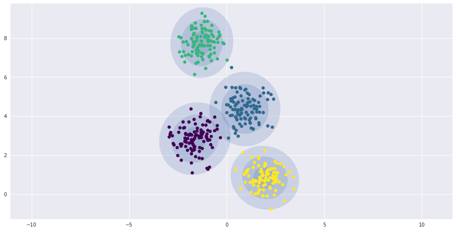

# Implementation: Linear Regression


```python
%matplotlib inline
import matplotlib.pyplot as plt
import seaborn as sns; sns.set()
import numpy as np
```

## Simple Linear Regression


```python
rng = np.random.RandomState(1)
x_train = 10 * rng.rand(50)
y_train = 2 * x_train - 5 + rng.randn(50)
plt.figure(figsize=(16,8))
plt.scatter(x_train, y_train);
```


```python
from sklearn.linear_model import LinearRegression
model = LinearRegression(fit_intercept=True)

model.fit(x_train[:, np.newaxis], y_train)

x_test = np.linspace(0, 10, 1000)
y_estimated = model.predict(x_test[:, np.newaxis])

plt.figure(figsize=(16,8))
plt.scatter(x_train, y_train)
plt.plot(x_test, y_estimated);
```


```python
print("Model slope:    ", model.coef_[0])
print("Model intercept:", model.intercept_)
```

    Model slope:     2.02720881036
    Model intercept: -4.99857708555


```python
rng = np.random.RandomState(1)
X = 10 * rng.rand(100, 3)
y = 0.5 + np.dot(X, [1.5, -2., 1.])

model.fit(X, y)
print(model.intercept_)
print(model.coef_)
```

    0.5
    [ 1.5 -2.   1. ]


## Basis Function Regression

To adapt linear regression to nonlinear relationships between variables is to transform the data according to *basis functions*.


The idea is to take multidimensional linear model:
$$
y = a_0 + a_1 x_1 + a_2 x_2 + a_3 x_3 + \cdots
$$

$$\text{We let   } x_n = f_n(x) \text{  , where    } f_n(x)  \text{  is some function that transforms our data.  }$$


take our one-dimensional $x$ values and projected them into a higher dimension

$$
y = a_0 + a_1 x + a_2 x^2 + a_3 x^3 + \cdots
$$


### Polynomial basis functions


```python
from sklearn.preprocessing import PolynomialFeatures
x = np.array([2, 3, 4])
poly = PolynomialFeatures(3, include_bias=False)
poly.fit_transform(x[:, None])
```


    array([[  2.,   4.,   8.],
           [  3.,   9.,  27.],
           [  4.,  16.,  64.]])


```python
from sklearn.pipeline import make_pipeline
poly_model = make_pipeline(PolynomialFeatures(7),
                           LinearRegression())
```


```python
rng = np.random.RandomState(1)
x = 10 * rng.rand(50)
y = np.sin(x) + 0.1 * rng.randn(50)

poly_model.fit(x[:, np.newaxis], y)
yfit = poly_model.predict(xfit[:, np.newaxis])

plt.figure(figsize=(16,8))
plt.scatter(x, y)
plt.plot(xfit, yfit);
```


### Gaussian basis functions


For example, one useful pattern is to fit a model that is a sum of Gaussian bases.


```python
from sklearn.pipeline import make_pipeline
from sklearn.linear_model import LinearRegression
from sklearn.base import BaseEstimator, TransformerMixin
import numpy as np
import matplotlib.pyplot as plt


class GaussianFeatures(BaseEstimator, TransformerMixin):
    def __init__(self, order, width_factor=2.0):
        self.order=order
        self.stddev_factor=width_factor

    def gaussian_basis(self, x, y, stddev, axis= None):
        arg = (x - y) / stddev
        return np.exp(-0.5 * np.sum(arg ** 2, axis))

    def fit(self, X, y): # make it private
        self.mu=np.linspace(X.min(), X.max(), self.order)
        self.stddev=self.stddev_factor*(self.mu[1]-self.mu[0])
        return self

    def transform(self, X):
        return self.gaussian_basis(X[:,:, np.newaxis], self.mu, self.stddev, axis=1)

rs=np.random.RandomState(10)
order=20

x_train=10*rs.rand(50)
y_train=np.sin(x_train)+0.1*rs.randn(50) # add white noise

x_test = np.linspace(0, 10, 1000)

gauss_model = make_pipeline(GaussianFeatures(order, 1.0),
                            LinearRegression())

gauss_model.fit(x_train[:, np.newaxis], y_train)


y_estimated=gauss_model.predict(x_test[:, np.newaxis])

gf=gauss_model.named_steps['gaussianfeatures']
lr=gauss_model.named_steps['linearregression']

fig, ax=plt.subplots(figsize=(16,8))

for i in range(order):
    encoder = np.zeros(order)
    encoder[i] = 1
    X_test = gf.transform(x_test[:, None]) * encoder
    Y_estimated=lr.predict(X_test)
    ax.fill_between(x_test, Y_estimated.min(), Y_estimated, color='gray', alpha=0.2)

ax.scatter(x_train,y_train)
ax.plot(x_test,y_estimated)

ax.set_xlim(0,10)
ax.set_ylim(-1.5, 1.5)

```


    (-1.5, 1.5)


__The shaded regions in the plot are the scaled basis functions, and when added together they reproduce the smooth curve through the data.__


## Regularization

Basis functions makes the model much more flexible, but it also can very quickly lead to over-fitting:


```python
model = make_pipeline(GaussianFeatures(40),
                      LinearRegression())
model.fit(x_train[:, np.newaxis], y_train)

plt.figure(figsize=(16,8))
plt.scatter(x_train, y_train)
plt.plot(x_test, model.predict(x_test[:, np.newaxis]))

plt.xlim(0, 10)
plt.ylim(-1.5, 1.5);
```


### Ridge regression (L2 Regularization)

The most common form of regularization is known as *ridge regression* or L2 *regularization*.

penalizing the sum of squares (2-norms) of the model coefficients

in this case, the penalty on the model fit would be 
$$
P = \alpha\sum_{n=1}^N \theta_n^2
$$


__where alpha is a free parameter that controls the strength of the penalty.__


```python
from sklearn.linear_model import Ridge
model = make_pipeline(GaussianFeatures(40), Ridge(alpha=0.1))
model.fit(x_train[:, np.newaxis], y_train)

plt.figure(figsize=(16,8))
plt.scatter(x_train, y_train)
plt.plot(x_test, model.predict(x_test[:, np.newaxis]))

plt.xlim(0, 10)
plt.ylim(-1.5, 1.5);
```


$$ \text{ The  } \alpha \text{   parameter is essentially controlling the complexity of the resulting model.}$$


One advantage of ridge regression in particular is that it can be computed very efficiently—at hardly more computational cost than the original linear regression model.

### Lasso regression (L1 regularization)


$$
P = \alpha\sum_{n=1}^N |\theta_n|
$$

Due to geometric reasons lasso regression tends to favor **sparse models** where possible


```python
from sklearn.linear_model import Lasso
model = make_pipeline(GaussianFeatures(40), Lasso(alpha=0.001))
model.fit(x_train[:, np.newaxis], y_train)

plt.figure(figsize=(16,8))
plt.scatter(x_train, y_train)
plt.plot(x_test, model.predict(x_test[:, np.newaxis]))

plt.xlim(0, 10)
plt.ylim(-1.5, 1.5);
```





```python
from mpl_toolkits.mplot3d.art3d import Line3DCollection

x_train = rng.randn(200, 2)
y_train = np.dot(x_train, [-2, 1]) + 0.1 * rng.randn(x_train.shape[0])

points = np.hstack([x_train, y_train[:, None]]).reshape(-1, 1, 3)
segments = np.hstack([points, points])
segments[:, 0, 2] = -8


fig = plt.figure(figsize=(16,8))
ax = fig.add_subplot(111, projection='3d')
ax.scatter(x_train[:, 0], x_train[:, 1], y_train, c=y_train, s=35,
           cmap='viridis')
ax.add_collection3d(Line3DCollection(segments, colors='gray', alpha=0.2))
ax.scatter(x_train[:, 0], x_train[:, 1], -8 + np.zeros(x_train.shape[0]), c=y_train, s=10,
           cmap='viridis')

# format plot
ax.patch.set_facecolor('white')
ax.view_init(elev=20, azim=-70)
ax.set_zlim3d(-8, 8)

ax.set(xlabel='feature 1', ylabel='feature 2', zlabel='label')


for tick in ax.w_xaxis.get_ticklines():
    tick.set_visible(False)
for tick in ax.w_yaxis.get_ticklines():
    tick.set_visible(False)
for tick in ax.w_zaxis.get_ticklines():
    tick.set_visible(False)

```


```python
def format_plot(ax, title):
    ax.xaxis.set_major_formatter(plt.NullFormatter())
    ax.yaxis.set_major_formatter(plt.NullFormatter())
    ax.set_xlabel('feature 1', color='gray')
    ax.set_ylabel('feature 2', color='gray')
    ax.set_title(title, color='gray')
```

## Example: Predicting Bicycle Traffic


```python
def random_sample_df(df, size=10):
    return df.iloc[np.random.randint(1, len(df), size, dtype=int)]
```


```python
# !curl -o FremontBridge.csv https://data.seattle.gov/api/views/65db-xm6k/rows.csv?accessType=DOWNLOAD
# wget https://raw.githubusercontent.com/jakevdp/PythonDataScienceHandbook/master/notebooks/data/BicycleWeather.csv
```


```python
import pandas as pd
import os
PATH='/home/karen/Downloads/data'
counts = pd.read_csv(os.path.join(PATH,'FremontBridge.csv'), index_col='Date', parse_dates=True)
weather = pd.read_csv(os.path.join(PATH,'BicycleWeather.csv'), index_col='DATE', parse_dates=True)
```


```python
random_sample_df(counts)
```


<div>
<table border="1" class="dataframe">
  <thead>
    <tr style="text-align: right;">
      <th></th>
      <th>Fremont Bridge West Sidewalk</th>
      <th>Fremont Bridge East Sidewalk</th>
    </tr>
    <tr>
      <th>Date</th>
      <th></th>
      <th></th>
    </tr>
  </thead>
  <tbody>
    <tr>
      <th>2015-12-13 02:00:00</th>
      <td>4</td>
      <td>0</td>
    </tr>
    <tr>
      <th>2013-12-24 04:00:00</th>
      <td>3</td>
      <td>3</td>
    </tr>
    <tr>
      <th>2015-02-03 11:00:00</th>
      <td>55</td>
      <td>0</td>
    </tr>
    <tr>
      <th>2014-11-17 11:00:00</th>
      <td>47</td>
      <td>3</td>
    </tr>
    <tr>
      <th>2017-07-06 10:00:00</th>
      <td>58</td>
      <td>84</td>
    </tr>
    <tr>
      <th>2013-07-08 20:00:00</th>
      <td>82</td>
      <td>83</td>
    </tr>
    <tr>
      <th>2015-09-22 09:00:00</th>
      <td>210</td>
      <td>124</td>
    </tr>
    <tr>
      <th>2015-07-29 04:00:00</th>
      <td>8</td>
      <td>2</td>
    </tr>
    <tr>
      <th>2015-04-16 15:00:00</th>
      <td>81</td>
      <td>82</td>
    </tr>
    <tr>
      <th>2014-09-23 09:00:00</th>
      <td>237</td>
      <td>27</td>
    </tr>
  </tbody>
</table>
</div>


```python
random_sample_df(weather, 5)
```


<div>
<table border="1" class="dataframe">
  <thead>
    <tr style="text-align: right;">
      <th></th>
      <th>STATION</th>
      <th>STATION_NAME</th>
      <th>PRCP</th>
      <th>SNWD</th>
      <th>SNOW</th>
      <th>TMAX</th>
      <th>TMIN</th>
      <th>AWND</th>
      <th>WDF2</th>
      <th>WDF5</th>
      <th>...</th>
      <th>WT17</th>
      <th>WT05</th>
      <th>WT02</th>
      <th>WT22</th>
      <th>WT04</th>
      <th>WT13</th>
      <th>WT16</th>
      <th>WT08</th>
      <th>WT18</th>
      <th>WT03</th>
    </tr>
    <tr>
      <th>DATE</th>
      <th></th>
      <th></th>
      <th></th>
      <th></th>
      <th></th>
      <th></th>
      <th></th>
      <th></th>
      <th></th>
      <th></th>
      <th></th>
      <th></th>
      <th></th>
      <th></th>
      <th></th>
      <th></th>
      <th></th>
      <th></th>
      <th></th>
      <th></th>
      <th></th>
    </tr>
  </thead>
  <tbody>
    <tr>
      <th>2013-06-30</th>
      <td>GHCND:USW00024233</td>
      <td>SEATTLE TACOMA INTERNATIONAL AIRPORT WA US</td>
      <td>0</td>
      <td>0</td>
      <td>0</td>
      <td>339</td>
      <td>172</td>
      <td>25</td>
      <td>300</td>
      <td>300</td>
      <td>...</td>
      <td>-9999</td>
      <td>-9999</td>
      <td>-9999</td>
      <td>-9999</td>
      <td>-9999</td>
      <td>-9999</td>
      <td>-9999</td>
      <td>-9999</td>
      <td>-9999</td>
      <td>-9999</td>
    </tr>
    <tr>
      <th>2015-02-13</th>
      <td>GHCND:USW00024233</td>
      <td>SEATTLE TACOMA INTERNATIONAL AIRPORT WA US</td>
      <td>0</td>
      <td>0</td>
      <td>0</td>
      <td>156</td>
      <td>67</td>
      <td>17</td>
      <td>130</td>
      <td>130</td>
      <td>...</td>
      <td>-9999</td>
      <td>-9999</td>
      <td>1</td>
      <td>-9999</td>
      <td>-9999</td>
      <td>-9999</td>
      <td>-9999</td>
      <td>-9999</td>
      <td>-9999</td>
      <td>-9999</td>
    </tr>
    <tr>
      <th>2012-04-27</th>
      <td>GHCND:USW00024233</td>
      <td>SEATTLE TACOMA INTERNATIONAL AIRPORT WA US</td>
      <td>8</td>
      <td>0</td>
      <td>0</td>
      <td>133</td>
      <td>61</td>
      <td>48</td>
      <td>210</td>
      <td>230</td>
      <td>...</td>
      <td>-9999</td>
      <td>-9999</td>
      <td>-9999</td>
      <td>-9999</td>
      <td>-9999</td>
      <td>-9999</td>
      <td>1</td>
      <td>-9999</td>
      <td>-9999</td>
      <td>-9999</td>
    </tr>
    <tr>
      <th>2014-05-17</th>
      <td>GHCND:USW00024233</td>
      <td>SEATTLE TACOMA INTERNATIONAL AIRPORT WA US</td>
      <td>0</td>
      <td>0</td>
      <td>0</td>
      <td>200</td>
      <td>117</td>
      <td>32</td>
      <td>190</td>
      <td>260</td>
      <td>...</td>
      <td>-9999</td>
      <td>-9999</td>
      <td>-9999</td>
      <td>-9999</td>
      <td>-9999</td>
      <td>-9999</td>
      <td>-9999</td>
      <td>-9999</td>
      <td>-9999</td>
      <td>-9999</td>
    </tr>
    <tr>
      <th>2012-03-09</th>
      <td>GHCND:USW00024233</td>
      <td>SEATTLE TACOMA INTERNATIONAL AIRPORT WA US</td>
      <td>36</td>
      <td>0</td>
      <td>0</td>
      <td>94</td>
      <td>50</td>
      <td>28</td>
      <td>230</td>
      <td>-9999</td>
      <td>...</td>
      <td>-9999</td>
      <td>-9999</td>
      <td>1</td>
      <td>-9999</td>
      <td>-9999</td>
      <td>-9999</td>
      <td>1</td>
      <td>-9999</td>
      <td>-9999</td>
      <td>-9999</td>
    </tr>
  </tbody>
</table>
<p>5 rows × 25 columns</p>
</div>


```python
counts['Total'] = counts.sum(axis=1) # row sum
random_sample_df(counts)
```


<div>
<table border="1" class="dataframe">
  <thead>
    <tr style="text-align: right;">
      <th></th>
      <th>Fremont Bridge West Sidewalk</th>
      <th>Fremont Bridge East Sidewalk</th>
      <th>Total</th>
    </tr>
    <tr>
      <th>Date</th>
      <th></th>
      <th></th>
      <th></th>
    </tr>
  </thead>
  <tbody>
    <tr>
      <th>2014-03-05 15:00:00</th>
      <td>30</td>
      <td>34</td>
      <td>64</td>
    </tr>
    <tr>
      <th>2017-06-29 08:00:00</th>
      <td>583</td>
      <td>328</td>
      <td>911</td>
    </tr>
    <tr>
      <th>2017-09-29 16:00:00</th>
      <td>96</td>
      <td>199</td>
      <td>295</td>
    </tr>
    <tr>
      <th>2013-10-02 02:00:00</th>
      <td>1</td>
      <td>1</td>
      <td>2</td>
    </tr>
    <tr>
      <th>2013-02-27 22:00:00</th>
      <td>6</td>
      <td>14</td>
      <td>20</td>
    </tr>
    <tr>
      <th>2014-08-26 12:00:00</th>
      <td>71</td>
      <td>72</td>
      <td>143</td>
    </tr>
    <tr>
      <th>2013-10-09 01:00:00</th>
      <td>5</td>
      <td>0</td>
      <td>5</td>
    </tr>
    <tr>
      <th>2016-07-25 22:00:00</th>
      <td>16</td>
      <td>24</td>
      <td>40</td>
    </tr>
    <tr>
      <th>2013-01-03 07:00:00</th>
      <td>108</td>
      <td>41</td>
      <td>149</td>
    </tr>
    <tr>
      <th>2017-08-31 06:00:00</th>
      <td>78</td>
      <td>63</td>
      <td>141</td>
    </tr>
  </tbody>
</table>
</div>


```python
days = ['Mon', 'Tue', 'Wed', 'Thu', 'Fri', 'Sat', 'Sun']

for i in range(7):
    counts[days[i]] = (counts.index.dayofweek == i).astype(float)
```


```python
random_sample_df(counts)
```


<div>
<table border="1" class="dataframe">
  <thead>
    <tr style="text-align: right;">
      <th></th>
      <th>Fremont Bridge West Sidewalk</th>
      <th>Fremont Bridge East Sidewalk</th>
      <th>Total</th>
      <th>Mon</th>
      <th>Tue</th>
      <th>Wed</th>
      <th>Thu</th>
      <th>Fri</th>
      <th>Sat</th>
      <th>Sun</th>
    </tr>
    <tr>
      <th>Date</th>
      <th></th>
      <th></th>
      <th></th>
      <th></th>
      <th></th>
      <th></th>
      <th></th>
      <th></th>
      <th></th>
      <th></th>
    </tr>
  </thead>
  <tbody>
    <tr>
      <th>2014-07-10 04:00:00</th>
      <td>8</td>
      <td>1</td>
      <td>9</td>
      <td>0</td>
      <td>0</td>
      <td>0</td>
      <td>1</td>
      <td>0</td>
      <td>0</td>
      <td>0</td>
    </tr>
    <tr>
      <th>2012-11-16 11:00:00</th>
      <td>47</td>
      <td>26</td>
      <td>73</td>
      <td>0</td>
      <td>0</td>
      <td>0</td>
      <td>0</td>
      <td>1</td>
      <td>0</td>
      <td>0</td>
    </tr>
    <tr>
      <th>2015-12-22 23:00:00</th>
      <td>1</td>
      <td>8</td>
      <td>9</td>
      <td>0</td>
      <td>1</td>
      <td>0</td>
      <td>0</td>
      <td>0</td>
      <td>0</td>
      <td>0</td>
    </tr>
    <tr>
      <th>2014-08-01 00:00:00</th>
      <td>11</td>
      <td>14</td>
      <td>25</td>
      <td>0</td>
      <td>0</td>
      <td>0</td>
      <td>0</td>
      <td>1</td>
      <td>0</td>
      <td>0</td>
    </tr>
    <tr>
      <th>2013-08-14 06:00:00</th>
      <td>100</td>
      <td>47</td>
      <td>147</td>
      <td>0</td>
      <td>0</td>
      <td>1</td>
      <td>0</td>
      <td>0</td>
      <td>0</td>
      <td>0</td>
    </tr>
    <tr>
      <th>2017-06-24 13:00:00</th>
      <td>173</td>
      <td>88</td>
      <td>261</td>
      <td>0</td>
      <td>0</td>
      <td>0</td>
      <td>0</td>
      <td>0</td>
      <td>1</td>
      <td>0</td>
    </tr>
    <tr>
      <th>2017-06-20 01:00:00</th>
      <td>0</td>
      <td>0</td>
      <td>0</td>
      <td>0</td>
      <td>1</td>
      <td>0</td>
      <td>0</td>
      <td>0</td>
      <td>0</td>
      <td>0</td>
    </tr>
    <tr>
      <th>2015-07-30 07:00:00</th>
      <td>271</td>
      <td>145</td>
      <td>416</td>
      <td>0</td>
      <td>0</td>
      <td>0</td>
      <td>1</td>
      <td>0</td>
      <td>0</td>
      <td>0</td>
    </tr>
    <tr>
      <th>2013-02-25 07:00:00</th>
      <td>135</td>
      <td>54</td>
      <td>189</td>
      <td>1</td>
      <td>0</td>
      <td>0</td>
      <td>0</td>
      <td>0</td>
      <td>0</td>
      <td>0</td>
    </tr>
    <tr>
      <th>2015-05-20 08:00:00</th>
      <td>419</td>
      <td>186</td>
      <td>605</td>
      <td>0</td>
      <td>0</td>
      <td>1</td>
      <td>0</td>
      <td>0</td>
      <td>0</td>
      <td>0</td>
    </tr>
  </tbody>
</table>
</div>


```python
pd.Series(1, index=holidays, name='holiday').head()
```


    2012-01-02    1
    2012-01-16    1
    2012-02-20    1
    2012-05-28    1
    2012-07-04    1
    Name: holiday, dtype: int64


```python
from pandas.tseries.holiday import USFederalHolidayCalendar
cal = USFederalHolidayCalendar()
holidays = cal.holidays('2012', '2016')
temp = counts[['Total']].join(pd.Series(1, index=holidays, name='holiday'))
temp['holiday'].fillna(0, inplace=True)
#daily['holiday'].isnull().unique()
counts['holiday']=temp['holiday']
random_sample_df(counts)
```


<div>
<table border="1" class="dataframe">
  <thead>
    <tr style="text-align: right;">
      <th></th>
      <th>Fremont Bridge West Sidewalk</th>
      <th>Fremont Bridge East Sidewalk</th>
      <th>Total</th>
      <th>Mon</th>
      <th>Tue</th>
      <th>Wed</th>
      <th>Thu</th>
      <th>Fri</th>
      <th>Sat</th>
      <th>Sun</th>
      <th>holiday</th>
    </tr>
    <tr>
      <th>Date</th>
      <th></th>
      <th></th>
      <th></th>
      <th></th>
      <th></th>
      <th></th>
      <th></th>
      <th></th>
      <th></th>
      <th></th>
      <th></th>
    </tr>
  </thead>
  <tbody>
    <tr>
      <th>2016-12-14 07:00:00</th>
      <td>118</td>
      <td>72</td>
      <td>190</td>
      <td>0</td>
      <td>0</td>
      <td>1</td>
      <td>0</td>
      <td>0</td>
      <td>0</td>
      <td>0</td>
      <td>0</td>
    </tr>
    <tr>
      <th>2014-10-24 07:00:00</th>
      <td>189</td>
      <td>57</td>
      <td>246</td>
      <td>0</td>
      <td>0</td>
      <td>0</td>
      <td>0</td>
      <td>1</td>
      <td>0</td>
      <td>0</td>
      <td>0</td>
    </tr>
    <tr>
      <th>2014-12-04 05:00:00</th>
      <td>19</td>
      <td>4</td>
      <td>23</td>
      <td>0</td>
      <td>0</td>
      <td>0</td>
      <td>1</td>
      <td>0</td>
      <td>0</td>
      <td>0</td>
      <td>0</td>
    </tr>
    <tr>
      <th>2014-12-29 16:00:00</th>
      <td>58</td>
      <td>76</td>
      <td>134</td>
      <td>1</td>
      <td>0</td>
      <td>0</td>
      <td>0</td>
      <td>0</td>
      <td>0</td>
      <td>0</td>
      <td>0</td>
    </tr>
    <tr>
      <th>2017-04-15 03:00:00</th>
      <td>2</td>
      <td>1</td>
      <td>3</td>
      <td>0</td>
      <td>0</td>
      <td>0</td>
      <td>0</td>
      <td>0</td>
      <td>1</td>
      <td>0</td>
      <td>0</td>
    </tr>
    <tr>
      <th>2013-04-05 03:00:00</th>
      <td>0</td>
      <td>0</td>
      <td>0</td>
      <td>0</td>
      <td>0</td>
      <td>0</td>
      <td>0</td>
      <td>1</td>
      <td>0</td>
      <td>0</td>
      <td>0</td>
    </tr>
    <tr>
      <th>2013-05-06 20:00:00</th>
      <td>64</td>
      <td>66</td>
      <td>130</td>
      <td>1</td>
      <td>0</td>
      <td>0</td>
      <td>0</td>
      <td>0</td>
      <td>0</td>
      <td>0</td>
      <td>0</td>
    </tr>
    <tr>
      <th>2013-12-02 05:00:00</th>
      <td>22</td>
      <td>6</td>
      <td>28</td>
      <td>1</td>
      <td>0</td>
      <td>0</td>
      <td>0</td>
      <td>0</td>
      <td>0</td>
      <td>0</td>
      <td>0</td>
    </tr>
    <tr>
      <th>2014-05-07 17:00:00</th>
      <td>285</td>
      <td>573</td>
      <td>858</td>
      <td>0</td>
      <td>0</td>
      <td>1</td>
      <td>0</td>
      <td>0</td>
      <td>0</td>
      <td>0</td>
      <td>0</td>
    </tr>
    <tr>
      <th>2016-06-12 22:00:00</th>
      <td>9</td>
      <td>14</td>
      <td>23</td>
      <td>0</td>
      <td>0</td>
      <td>0</td>
      <td>0</td>
      <td>0</td>
      <td>0</td>
      <td>1</td>
      <td>0</td>
    </tr>
  </tbody>
</table>
</div>


```python
def hours_of_daylight(date, axis=23.44, latitude=47.61):
    """Compute the hours of daylight for the given date"""
    days = (date - pd.datetime(2000, 12, 21)).days
    m = (1. - np.tan(np.radians(latitude))
         * np.tan(np.radians(axis) * np.cos(days * 2 * np.pi / 365.25)))
    return 24. * np.degrees(np.arccos(1 - np.clip(m, 0, 2))) / 180.

counts['daylight_hrs'] = list(map(hours_of_daylight, daily.index))
counts[['daylight_hrs']].plot(figsize=(16,8))
plt.ylim(8, 17)
```

    /usr/local/lib/python3.5/dist-packages/matplotlib/__init__.py:830: MatplotlibDeprecationWarning: axes.color_cycle is deprecated and replaced with axes.prop_cycle; please use the latter.
      mplDeprecation)


    (8, 17)


```python
# temperatures are in 1/10 deg C; convert to C
weather['TMIN'] /= 10
weather['TMAX'] /= 10
weather['Temp (C)'] = 0.5 * (weather['TMIN'] + weather['TMAX'])

# precip is in 1/10 mm; convert to inches
weather['PRCP'] /= 254
weather['dry day'] = (weather['PRCP'] == 0).astype(int)

temp = counts[['Total']].join(weather[['PRCP', 'Temp (C)', 'dry day']])
random_sample_df(temp)
```


<div>
<table border="1" class="dataframe">
  <thead>
    <tr style="text-align: right;">
      <th></th>
      <th>Total</th>
      <th>PRCP</th>
      <th>Temp (C)</th>
      <th>dry day</th>
    </tr>
    <tr>
      <th>Date</th>
      <th></th>
      <th></th>
      <th></th>
      <th></th>
    </tr>
  </thead>
  <tbody>
    <tr>
      <th>2014-07-22 17:00:00</th>
      <td>702</td>
      <td>NaN</td>
      <td>NaN</td>
      <td>NaN</td>
    </tr>
    <tr>
      <th>2014-04-21 20:00:00</th>
      <td>68</td>
      <td>NaN</td>
      <td>NaN</td>
      <td>NaN</td>
    </tr>
    <tr>
      <th>2016-12-29 15:00:00</th>
      <td>71</td>
      <td>NaN</td>
      <td>NaN</td>
      <td>NaN</td>
    </tr>
    <tr>
      <th>2013-02-28 16:00:00</th>
      <td>118</td>
      <td>NaN</td>
      <td>NaN</td>
      <td>NaN</td>
    </tr>
    <tr>
      <th>2016-03-17 05:00:00</th>
      <td>29</td>
      <td>NaN</td>
      <td>NaN</td>
      <td>NaN</td>
    </tr>
    <tr>
      <th>2017-06-10 12:00:00</th>
      <td>269</td>
      <td>NaN</td>
      <td>NaN</td>
      <td>NaN</td>
    </tr>
    <tr>
      <th>2016-11-16 09:00:00</th>
      <td>230</td>
      <td>NaN</td>
      <td>NaN</td>
      <td>NaN</td>
    </tr>
    <tr>
      <th>2014-11-22 13:00:00</th>
      <td>84</td>
      <td>NaN</td>
      <td>NaN</td>
      <td>NaN</td>
    </tr>
    <tr>
      <th>2012-11-12 04:00:00</th>
      <td>2</td>
      <td>NaN</td>
      <td>NaN</td>
      <td>NaN</td>
    </tr>
    <tr>
      <th>2013-05-17 15:00:00</th>
      <td>197</td>
      <td>NaN</td>
      <td>NaN</td>
      <td>NaN</td>
    </tr>
  </tbody>
</table>
</div>


```python
temp['annual'] = (temp.index - temp.index[0]).days / 365.
```


```python
counts[['PRCP', 'Temp (C)', 'dry day','annual']]=temp[['PRCP', 'Temp (C)', 'dry day','annual']]
random_sample_df(counts)
```


<div>
<table border="1" class="dataframe">
  <thead>
    <tr style="text-align: right;">
      <th></th>
      <th>Fremont Bridge West Sidewalk</th>
      <th>Fremont Bridge East Sidewalk</th>
      <th>Total</th>
      <th>Mon</th>
      <th>Tue</th>
      <th>Wed</th>
      <th>Thu</th>
      <th>Fri</th>
      <th>Sat</th>
      <th>Sun</th>
      <th>holiday</th>
      <th>daylight_hrs</th>
      <th>PRCP</th>
      <th>Temp (C)</th>
      <th>dry day</th>
      <th>annual</th>
    </tr>
    <tr>
      <th>Date</th>
      <th></th>
      <th></th>
      <th></th>
      <th></th>
      <th></th>
      <th></th>
      <th></th>
      <th></th>
      <th></th>
      <th></th>
      <th></th>
      <th></th>
      <th></th>
      <th></th>
      <th></th>
      <th></th>
    </tr>
  </thead>
  <tbody>
    <tr>
      <th>2015-07-15 06:00:00</th>
      <td>147</td>
      <td>53</td>
      <td>200</td>
      <td>0</td>
      <td>0</td>
      <td>1</td>
      <td>0</td>
      <td>0</td>
      <td>0</td>
      <td>0</td>
      <td>0</td>
      <td>15.436525</td>
      <td>NaN</td>
      <td>NaN</td>
      <td>NaN</td>
      <td>2.780822</td>
    </tr>
    <tr>
      <th>2016-01-11 15:00:00</th>
      <td>28</td>
      <td>41</td>
      <td>69</td>
      <td>1</td>
      <td>0</td>
      <td>0</td>
      <td>0</td>
      <td>0</td>
      <td>0</td>
      <td>0</td>
      <td>0</td>
      <td>8.491083</td>
      <td>NaN</td>
      <td>NaN</td>
      <td>NaN</td>
      <td>3.273973</td>
    </tr>
    <tr>
      <th>2017-06-07 19:00:00</th>
      <td>315</td>
      <td>113</td>
      <td>428</td>
      <td>0</td>
      <td>0</td>
      <td>1</td>
      <td>0</td>
      <td>0</td>
      <td>0</td>
      <td>0</td>
      <td>0</td>
      <td>15.637118</td>
      <td>NaN</td>
      <td>NaN</td>
      <td>NaN</td>
      <td>4.679452</td>
    </tr>
    <tr>
      <th>2013-06-07 01:00:00</th>
      <td>2</td>
      <td>5</td>
      <td>7</td>
      <td>0</td>
      <td>0</td>
      <td>0</td>
      <td>0</td>
      <td>1</td>
      <td>0</td>
      <td>0</td>
      <td>0</td>
      <td>15.637118</td>
      <td>NaN</td>
      <td>NaN</td>
      <td>NaN</td>
      <td>0.676712</td>
    </tr>
    <tr>
      <th>2013-04-22 10:00:00</th>
      <td>63</td>
      <td>44</td>
      <td>107</td>
      <td>1</td>
      <td>0</td>
      <td>0</td>
      <td>0</td>
      <td>0</td>
      <td>0</td>
      <td>0</td>
      <td>0</td>
      <td>13.765175</td>
      <td>NaN</td>
      <td>NaN</td>
      <td>NaN</td>
      <td>0.550685</td>
    </tr>
    <tr>
      <th>2016-10-27 07:00:00</th>
      <td>169</td>
      <td>105</td>
      <td>274</td>
      <td>0</td>
      <td>0</td>
      <td>0</td>
      <td>1</td>
      <td>0</td>
      <td>0</td>
      <td>0</td>
      <td>0</td>
      <td>9.933420</td>
      <td>NaN</td>
      <td>NaN</td>
      <td>NaN</td>
      <td>4.068493</td>
    </tr>
    <tr>
      <th>2016-07-27 13:00:00</th>
      <td>48</td>
      <td>47</td>
      <td>95</td>
      <td>0</td>
      <td>0</td>
      <td>1</td>
      <td>0</td>
      <td>0</td>
      <td>0</td>
      <td>0</td>
      <td>0</td>
      <td>14.985694</td>
      <td>NaN</td>
      <td>NaN</td>
      <td>NaN</td>
      <td>3.816438</td>
    </tr>
    <tr>
      <th>2014-10-21 18:00:00</th>
      <td>126</td>
      <td>227</td>
      <td>353</td>
      <td>0</td>
      <td>1</td>
      <td>0</td>
      <td>0</td>
      <td>0</td>
      <td>0</td>
      <td>0</td>
      <td>0</td>
      <td>10.282679</td>
      <td>NaN</td>
      <td>NaN</td>
      <td>NaN</td>
      <td>2.049315</td>
    </tr>
    <tr>
      <th>2014-03-04 01:00:00</th>
      <td>2</td>
      <td>0</td>
      <td>2</td>
      <td>0</td>
      <td>1</td>
      <td>0</td>
      <td>0</td>
      <td>0</td>
      <td>0</td>
      <td>0</td>
      <td>0</td>
      <td>10.915587</td>
      <td>NaN</td>
      <td>NaN</td>
      <td>NaN</td>
      <td>1.416438</td>
    </tr>
    <tr>
      <th>2015-08-25 08:00:00</th>
      <td>403</td>
      <td>212</td>
      <td>615</td>
      <td>0</td>
      <td>1</td>
      <td>0</td>
      <td>0</td>
      <td>0</td>
      <td>0</td>
      <td>0</td>
      <td>0</td>
      <td>13.586282</td>
      <td>NaN</td>
      <td>NaN</td>
      <td>NaN</td>
      <td>2.893151</td>
    </tr>
  </tbody>
</table>
</div>


```python
# Drop any rows with null values
counts.dropna(axis=0, how='any', inplace=True)

column_names = ['Mon', 'Tue', 'Wed', 'Thu', 'Fri', 'Sat', 'Sun', 'holiday',
                'daylight_hrs', 'PRCP', 'dry day', 'Temp (C)', 'annual']
X = counts[column_names]
y = counts['Total']

model = LinearRegression(fit_intercept=False)
model.fit(X, y)
counts['predicted'] = model.predict(X)
```


```python
random_sample_df(counts)
```


<div>
<table border="1" class="dataframe">
  <thead>
    <tr style="text-align: right;">
      <th></th>
      <th>Fremont Bridge West Sidewalk</th>
      <th>Fremont Bridge East Sidewalk</th>
      <th>Total</th>
      <th>Mon</th>
      <th>Tue</th>
      <th>Wed</th>
      <th>Thu</th>
      <th>Fri</th>
      <th>Sat</th>
      <th>Sun</th>
      <th>holiday</th>
      <th>daylight_hrs</th>
      <th>PRCP</th>
      <th>Temp (C)</th>
      <th>dry day</th>
      <th>annual</th>
      <th>predicted</th>
    </tr>
    <tr>
      <th>Date</th>
      <th></th>
      <th></th>
      <th></th>
      <th></th>
      <th></th>
      <th></th>
      <th></th>
      <th></th>
      <th></th>
      <th></th>
      <th></th>
      <th></th>
      <th></th>
      <th></th>
      <th></th>
      <th></th>
      <th></th>
    </tr>
  </thead>
  <tbody>
    <tr>
      <th>2012-12-06</th>
      <td>2</td>
      <td>2</td>
      <td>4</td>
      <td>0</td>
      <td>0</td>
      <td>0</td>
      <td>1</td>
      <td>0</td>
      <td>0</td>
      <td>0</td>
      <td>0</td>
      <td>8.370238</td>
      <td>0.059055</td>
      <td>6.65</td>
      <td>0</td>
      <td>0.175342</td>
      <td>6.373532</td>
    </tr>
    <tr>
      <th>2014-06-07</th>
      <td>7</td>
      <td>13</td>
      <td>20</td>
      <td>0</td>
      <td>0</td>
      <td>0</td>
      <td>0</td>
      <td>0</td>
      <td>1</td>
      <td>0</td>
      <td>0</td>
      <td>15.632233</td>
      <td>0.000000</td>
      <td>18.85</td>
      <td>1</td>
      <td>1.676712</td>
      <td>25.216801</td>
    </tr>
    <tr>
      <th>2013-10-02</th>
      <td>8</td>
      <td>4</td>
      <td>12</td>
      <td>0</td>
      <td>0</td>
      <td>1</td>
      <td>0</td>
      <td>0</td>
      <td>0</td>
      <td>0</td>
      <td>0</td>
      <td>11.350277</td>
      <td>0.208661</td>
      <td>11.10</td>
      <td>0</td>
      <td>0.997260</td>
      <td>8.925524</td>
    </tr>
    <tr>
      <th>2013-10-03</th>
      <td>3</td>
      <td>2</td>
      <td>5</td>
      <td>0</td>
      <td>0</td>
      <td>0</td>
      <td>1</td>
      <td>0</td>
      <td>0</td>
      <td>0</td>
      <td>0</td>
      <td>11.291930</td>
      <td>0.031496</td>
      <td>11.65</td>
      <td>0</td>
      <td>1.000000</td>
      <td>10.050130</td>
    </tr>
    <tr>
      <th>2013-04-25</th>
      <td>5</td>
      <td>3</td>
      <td>8</td>
      <td>0</td>
      <td>0</td>
      <td>0</td>
      <td>1</td>
      <td>0</td>
      <td>0</td>
      <td>0</td>
      <td>0</td>
      <td>13.927345</td>
      <td>0.000000</td>
      <td>14.20</td>
      <td>1</td>
      <td>0.558904</td>
      <td>15.418059</td>
    </tr>
    <tr>
      <th>2013-03-28</th>
      <td>6</td>
      <td>4</td>
      <td>10</td>
      <td>0</td>
      <td>0</td>
      <td>0</td>
      <td>1</td>
      <td>0</td>
      <td>0</td>
      <td>0</td>
      <td>0</td>
      <td>12.334739</td>
      <td>0.078740</td>
      <td>12.20</td>
      <td>0</td>
      <td>0.482192</td>
      <td>11.144185</td>
    </tr>
    <tr>
      <th>2015-02-22</th>
      <td>6</td>
      <td>9</td>
      <td>15</td>
      <td>0</td>
      <td>0</td>
      <td>0</td>
      <td>0</td>
      <td>0</td>
      <td>0</td>
      <td>1</td>
      <td>0</td>
      <td>10.337655</td>
      <td>0.000000</td>
      <td>7.50</td>
      <td>1</td>
      <td>2.389041</td>
      <td>15.097460</td>
    </tr>
    <tr>
      <th>2015-05-23</th>
      <td>6</td>
      <td>9</td>
      <td>15</td>
      <td>0</td>
      <td>0</td>
      <td>0</td>
      <td>0</td>
      <td>0</td>
      <td>1</td>
      <td>0</td>
      <td>0</td>
      <td>15.198876</td>
      <td>0.000000</td>
      <td>13.90</td>
      <td>1</td>
      <td>2.635616</td>
      <td>21.720181</td>
    </tr>
    <tr>
      <th>2013-06-20</th>
      <td>4</td>
      <td>8</td>
      <td>12</td>
      <td>0</td>
      <td>0</td>
      <td>0</td>
      <td>1</td>
      <td>0</td>
      <td>0</td>
      <td>0</td>
      <td>0</td>
      <td>15.779300</td>
      <td>0.118110</td>
      <td>15.00</td>
      <td>0</td>
      <td>0.712329</td>
      <td>14.198361</td>
    </tr>
    <tr>
      <th>2014-12-28</th>
      <td>1</td>
      <td>5</td>
      <td>6</td>
      <td>0</td>
      <td>0</td>
      <td>0</td>
      <td>0</td>
      <td>0</td>
      <td>0</td>
      <td>1</td>
      <td>0</td>
      <td>8.247698</td>
      <td>0.161417</td>
      <td>4.75</td>
      <td>0</td>
      <td>2.235616</td>
      <td>10.060985</td>
    </tr>
  </tbody>
</table>
</div>


```python
counts[['Total', 'predicted']].plot(alpha=0.5, figsize=(16,8));
```

    /usr/local/lib/python3.5/dist-packages/matplotlib/__init__.py:830: MatplotlibDeprecationWarning: axes.color_cycle is deprecated and replaced with axes.prop_cycle; please use the latter.
      mplDeprecation)


It is evident that we have missed some key features, especially during the summer time.

Either our features are not complete (i.e., people decide whether to ride to work based on more than just these) or there are some nonlinear relationships that we have failed to take into account (e.g., perhaps people ride less at both high and low temperatures).


```python
params = pd.Series(model.coef_, index=X.columns)
abs(params).sort_values(ascending=False) # ranked on contribution to Total
```


    Mon             5.469967
    Sat             4.491504
    holiday         3.761860
    Sun             3.664945
    Wed             3.213085
    Tue             3.074720
    Thu             2.972465
    dry day         2.392941
    Fri             1.654775
    annual          0.893106
    daylight_hrs    0.629522
    Temp (C)        0.522309
    PRCP            0.040696
    dtype: float64


These numbers are difficult to interpret without some measure of their uncertainty.
We can compute these uncertainties quickly using bootstrap resamplings of the data:


```python
from sklearn.utils import resample
np.random.seed(1)
err = np.std([model.fit(*resample(X, y)).coef_
              for i in range(1000)], 0)
```


```python
print(pd.DataFrame({'effect': params.round(0),
                    'error': err.round(0)}))
```

                  effect  error
    Mon               -5      1
    Tue               -3      1
    Wed               -3      1
    Thu               -3      1
    Fri                2      1
    Sat                4      1
    Sun                4      1
    holiday            4      1
    daylight_hrs       1      0
    PRCP              -0      1
    dry day            2      0
    Temp (C)           1      0
    annual            -1      0

