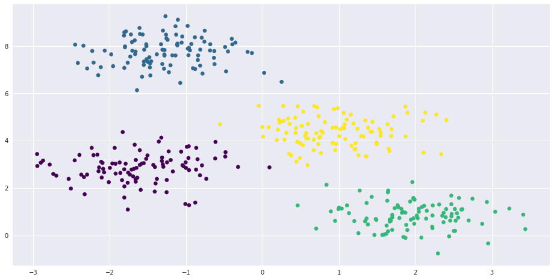
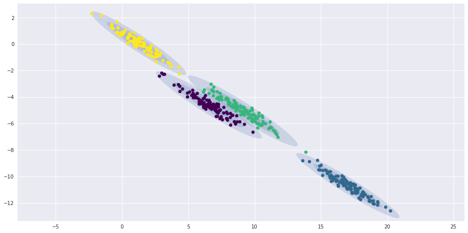
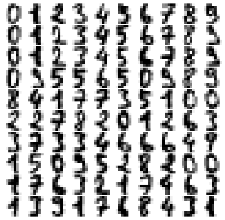
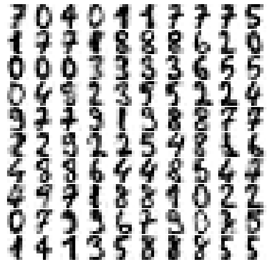

## K-Means and EM


```python
%matplotlib inline
import matplotlib.pyplot as plt
plt.rcParams["figure.figsize"] = (16,8)
import seaborn as sns; sns.set()  
import numpy as np
```

The *k*-means algorithm searches for a pre-determined number of clusters within an unlabeled multidimensional dataset.
It accomplishes this using a simple conception of what the optimal clustering looks like:

- The "cluster center" is the arithmetic mean of all the points belonging to the cluster.
- Each point is closer to its own cluster center than to other cluster centers.

Those two assumptions are the basis of the *k*-means model.


First, let's generate a two-dimensional dataset containing four distinct blobs.
To emphasize that this is an unsupervised algorithm, we will leave the labels out of the visualization


```python
from sklearn.datasets.samples_generator import make_blobs
X, y_true = make_blobs(n_samples=300, centers=4,
                       cluster_std=0.60, random_state=0)
plt.scatter(X[:, 0], X[:, 1], s=50, c=y_true);
```


```python
from sklearn.cluster import KMeans
kmeans = KMeans(n_clusters=4)
kmeans.fit(X)
y_kmeans = kmeans.predict(X)
```


```python
plt.scatter(X[:, 0], X[:, 1], c=y_kmeans, s=50, cmap='viridis')

centers = kmeans.cluster_centers_
plt.scatter(centers[:, 0], centers[:, 1], c='black', s=200, alpha=0.5);
```





## k-Means Algorithm: Expectation–Maximization

EM consists of the following procedure:

1. Guess some cluster centers
2. Repeat until converged
   1. *E-Step*: assign points to the nearest cluster center
   2. *M-Step*: set the cluster centers to the mean 

Here the "E-step" or "Expectation step" is so-named because it involves __updating our expectation of which cluster each point belongs to.__


The "M-step" or "Maximization step" is so-named because it involves __maximizing some fitness function that defines the location of the cluster centers__

- in this case, that maximization is accomplished by taking a simple mean of the data in each cluster.


```python
from sklearn.datasets.samples_generator import make_blobs
from sklearn.metrics import pairwise_distances_argmin

X, y_true = make_blobs(n_samples=300, centers=4,
                       cluster_std=0.60, random_state=0)

rng = np.random.RandomState(1)
centers = [0, 4] + rng.randn(4, 2)
```


```python
def draw_points(ax, c, factor=1):
    ax.scatter(X[:, 0], X[:, 1], c=c, cmap='viridis',
               s=50 * factor, alpha=0.3)
```


```python
def draw_centers(ax, centers, factor=1, alpha=1.0):
    ax.scatter(centers[:, 0], centers[:, 1],
               c=np.arange(4), cmap='viridis', s=200 * factor,
               alpha=alpha)
    ax.scatter(centers[:, 0], centers[:, 1],
               c='black', s=50 * factor, alpha=alpha)
```


```python
def make_ax(fig, gs):
    ax = fig.add_subplot(gs)
    ax.xaxis.set_major_formatter(plt.NullFormatter())
    ax.yaxis.set_major_formatter(plt.NullFormatter())
    return ax
```


```python
fig = plt.figure(figsize=(15, 4))
gs = plt.GridSpec(4, 15, left=0.02, right=0.98, bottom=0.05, top=0.95, wspace=0.2, hspace=0.2)
ax0 = make_ax(fig, gs[:4, :4])
ax0.text(0.98, 0.98, "Random Initialization", transform=ax0.transAxes,
         ha='right', va='top', size=16)
draw_points(ax0, 'gray', factor=2)
draw_centers(ax0, centers, factor=2)

for i in range(3):
    ax1 = make_ax(fig, gs[:2, 4 + 2 * i:6 + 2 * i])
    ax2 = make_ax(fig, gs[2:, 5 + 2 * i:7 + 2 * i])
    
    # E-step
    y_pred = pairwise_distances_argmin(X, centers) # pick the closest center to the testing point and assign it to the new center
    draw_points(ax1, y_pred)
    draw_centers(ax1, centers)
    
    # M-step
    new_centers = np.array([X[y_pred == i].mean(0) for i in range(4)])
    draw_points(ax2, y_pred)
    draw_centers(ax2, centers, alpha=0.3)
    draw_centers(ax2, new_centers, alpha=0.8)
    
    for i in range(4):
        ax2.annotate('', new_centers[i], centers[i],
                     arrowprops=dict(arrowstyle='->', linewidth=1))
        
    # Final update
    centers = new_centers
    ax1.text(0.95, 0.95, "E-Step", transform=ax1.transAxes, ha='right', va='top', size=14)
    ax2.text(0.95, 0.95, "M-Step", transform=ax2.transAxes, ha='right', va='top', size=14)
    
y_pred = pairwise_distances_argmin(X, centers)
axf = make_ax(fig, gs[:4, -4:])
draw_points(axf, y_pred, factor=2)
draw_centers(axf, centers, factor=2)
axf.text(0.98, 0.98, "Final Clustering", transform=axf.transAxes,
         ha='right', va='top', size=16)
```


    Text(0.98,0.98,'Final Clustering')


```python
from sklearn.metrics import pairwise_distances_argmin

def find_clusters(X, n_clusters, rseed=1):
    # Randomly choose clusters
    rng = np.random.RandomState(rseed)
    i = rng.permutation(X.shape[0])[:n_clusters]
    centers = X[i]
    
    while True:
        # assign labels based on closest center
        labels = pairwise_distances_argmin(X, centers)
        
        # find new centers from mean
        new_centers = np.array([X[labels == i].mean(0)
                                for i in range(n_clusters)])
        
        # check for convergence
        if np.all(centers == new_centers):
            break
        centers = new_centers
    
    return centers, labels

centers, labels = find_clusters(X, 4)

plt.scatter(X[:, 0], X[:, 1], c=labels,
            s=50, cmap='viridis')

plt.scatter(centers[:, 0], centers[:, 1],
               c=np.arange(4), cmap='viridis', s=200 ,
               alpha=0.6)
plt.scatter(centers[:, 0], centers[:, 1],
               c='black', s=500, alpha=0.6)
```


    <matplotlib.collections.PathCollection at 0x7fc803cda198>


### Caveats of expectation–maximization

There are a few issues to be aware of when using the expectation–maximization algorithm.

#### The globally optimal result may not be achieved
First, although the E–M procedure is guaranteed to improve the result in each step, there is no assurance that it will lead to the *global* best solution.
For example, __if we use a different random seed in our simple procedure, the particular starting guesses lead to poor results__:


```python
centers, labels = find_clusters(X, 4, rseed=208)
plt.scatter(X[:, 0], X[:, 1], c=labels,
            s=50, cmap='viridis');
```


Here the E–M approach has converged, but has not converged to a globally optimal configuration. 


For this reason, it is common for the algorithm to be __run for multiple starting guesses__, Scikit-Learn does by default (set by the ``n_init`` parameter, which defaults to 10).

#### The number of clusters must be selected beforehand


__Another common challenge with *k*-means is that you must tell it how many clusters you expect: it cannot learn the number of clusters from the data.__


```python
labels = KMeans(6, random_state=208).fit_predict(X)
plt.scatter(X[:, 0], X[:, 1], c=labels,
            s=50, cmap='viridis');
```


Alternatively, we might use a more complicated clustering algorithm which has a better quantitative measure of the fitness per number of clusters (e.g., Gaussian mixture models) or which *can* choose a suitable number of clusters (e.g., DBSCAN, mean-shift, or affinity propagation, all in the ``sklearn.cluster`` submodule)

#### k-means is limited to linear cluster boundaries
The fundamental model assumptions of *k*-means (points will be closer to their own cluster center than to others) means that the algorithm will often be ineffective if the clusters have complicated geometries.

In particular, the boundaries between *k*-means clusters will always be linear, which means that it will fail for more complicated boundaries.
Consider the following data, along with the cluster labels found by the typical *k*-means approach:


```python
from sklearn.datasets import make_moons
X, y = make_moons(200, noise=.05, random_state=0)
```


```python
labels = KMeans(2, random_state=0).fit_predict(X)
plt.scatter(X[:, 0], X[:, 1], c=labels,
            s=50, cmap='viridis');
```





This situation is reminiscent of the discussion in [In-Depth: Support Vector Machines](05.07-Support-Vector-Machines.ipynb), where we used a kernel transformation to project the data into a higher dimension where a linear separation is possible.
We might imagine using the same trick to allow *k*-means to discover non-linear boundaries.

One version of this __kernelized *k*-means is implemented in the ``SpectralClustering`` estimator.__

It uses the graph of nearest neighbors to compute a higher-dimensional representation of the data, and then assigns labels using a *k*-means algorithm:


```python
from sklearn.cluster import SpectralClustering
model = SpectralClustering(n_clusters=2, affinity='nearest_neighbors',
                           assign_labels='kmeans')
labels = model.fit_predict(X)
plt.scatter(X[:, 0], X[:, 1], c=labels,
            s=50, cmap='viridis');
```

    /usr/local/lib/python3.5/dist-packages/sklearn/manifold/spectral_embedding_.py:234: UserWarning: Graph is not fully connected, spectral embedding may not work as expected.
      warnings.warn("Graph is not fully connected, spectral embedding"


We see that with this kernel transform approach, the kernelized *k*-means is able to find the more complicated nonlinear boundaries between clusters.

#### k-means can be slow for large numbers of samples

Because each iteration of *k*-means must access every point in the dataset, the algorithm can be relatively slow as the number of samples grows.


But we might just use a subset of the data to update the cluster centers at each step: __batch-based *k*-means algorithms__ in ``sklearn.cluster.MiniBatchKMeans``.


## Examples


### Example 1: k-means on digits


```python
from sklearn.datasets import load_digits
digits = load_digits()
digits.data.shape
```


    (1797, 64)


```python
kmeans = KMeans(n_clusters=10, random_state=0)
clusters = kmeans.fit_predict(digits.data)
kmeans.cluster_centers_.shape
```


    (10, 64)


```python
fig, ax = plt.subplots(2, 5, figsize=(8, 3))
centers = kmeans.cluster_centers_.reshape(10, 8, 8)
for axi, center in zip(ax.flat, centers):
    axi.set(xticks=[], yticks=[])
    axi.imshow(center, interpolation='nearest', cmap=plt.cm.binary)
```


We see that *even without the labels*, ``KMeans`` is able to find clusters whose centers are recognizable digits, with perhaps the exception of 1 and 8.

Because *k*-means knows nothing about the identity of the cluster, the 0–9 labels may be permuted.
We can fix this by matching each learned cluster label with the true labels found in them:


```python
from scipy.stats import mode

labels = np.zeros_like(clusters)
for i in range(10):
    mask = (clusters == i)
    labels[mask] = mode(digits.target[mask])[0]
    print(labels)
```

    [0 0 0 ..., 0 0 0]
    [0 0 0 ..., 0 0 0]
    [0 0 0 ..., 0 0 0]
    [0 0 0 ..., 0 9 9]
    [0 0 0 ..., 0 9 9]
    [0 0 0 ..., 0 9 9]
    [0 0 0 ..., 0 9 9]
    [0 8 8 ..., 8 9 9]
    [0 8 8 ..., 8 9 9]
    [0 8 8 ..., 8 9 9]


```python
from sklearn.metrics import accuracy_score
accuracy_score(digits.target, labels)
```


    0.79354479688369506


```python
from sklearn.metrics import confusion_matrix
mat = confusion_matrix(digits.target, labels)
sns.heatmap(mat.T, square=True, annot=True, fmt='d', cbar=False, cmap="YlGnBu",
            xticklabels=digits.target_names,
            yticklabels=digits.target_names)
plt.xlabel('true label')
plt.ylabel('predicted label');
```





> What if we use the t-SNE algorithm to pre-process the data before performing *k*-means.


```python
from sklearn.manifold import TSNE

tsne = TSNE(n_components=2, init='random', random_state=0)
digits_proj = tsne.fit_transform(digits.data)


kmeans = KMeans(n_clusters=10, random_state=0)
clusters = kmeans.fit_predict(digits_proj)

labels = np.zeros_like(clusters)
for i in range(10):
    mask = (clusters == i)
    labels[mask] = mode(digits.target[mask])[0]

accuracy_score(digits.target, labels)
```


    0.9326655537006121


### Example 2: *k*-means for color compression

One CV application of clustering is in color compression within images.

In most images, a large number of the colors will be unused, and many of the pixels in the image will have similar or even identical colors.


```python
from sklearn.datasets import load_sample_image
flower = load_sample_image("flower.jpg")
ax = plt.axes(xticks=[], yticks=[])
ax.imshow(flower);
```

    /usr/local/lib/python3.5/dist-packages/sklearn/datasets/base.py:762: DeprecationWarning: `imread` is deprecated!
    `imread` is deprecated in SciPy 1.0.0, and will be removed in 1.2.0.
    Use ``imageio.imread`` instead.
      images = [imread(filename) for filename in filenames]
    /usr/local/lib/python3.5/dist-packages/sklearn/datasets/base.py:762: DeprecationWarning: `imread` is deprecated!
    `imread` is deprecated in SciPy 1.0.0, and will be removed in 1.2.0.
    Use ``imageio.imread`` instead.
      images = [imread(filename) for filename in filenames]


```python
flower.shape
```


    (427, 640, 3)


- reshape the data to ``[n_samples x n_features]``
- rescale the colors so that they lie between 0 and 1


```python
data = flower / 255.0 # use 0...1 scale
data = data.reshape(-1, 3)
data.shape
```


    (273280, 3)


```python
def plot_pixels(data, title, colors=None, N=10000):
    if colors is None:
        colors = data
    
    # choose a random subset
    rng = np.random.RandomState(0)
    i = rng.permutation(data.shape[0])[:N]
    colors = colors[i]
    R, G, B = data[i].T
    
    fig, ax = plt.subplots(1, 2, figsize=(16, 6))
    ax[0].scatter(R, G, color=colors, marker='.')
    ax[0].set(xlabel='Red', ylabel='Green', xlim=(0, 1), ylim=(0, 1))

    ax[1].scatter(R, B, color=colors, marker='.')
    ax[1].set(xlabel='Red', ylabel='Blue', xlim=(0, 1), ylim=(0, 1))

    fig.suptitle(title, size=20);
```


```python
plot_pixels(data, title='Input color space: 16 million possible colors')
```





- reduce these 16 million colors to just 16 colors, using a *k*-means clustering across the pixel space.

- use the `mini batch *k*-means`, which operates on subsets of the data to compute the result much more quickly than the standard *k*-means algorithm


```python
from sklearn.cluster import MiniBatchKMeans
kmeans = MiniBatchKMeans(16) # leave only 16 colors
kmeans.fit(data)
new_colors = kmeans.cluster_centers_[kmeans.predict(data)]

plot_pixels(data, colors=new_colors,
            title="Reduced color space: 16 colors")
```


```python
flower_recolored = new_colors.reshape(flower.shape)

fig, ax = plt.subplots(1, 2, figsize=(16, 6),
                       subplot_kw=dict(xticks=[], yticks=[]))
fig.subplots_adjust(wspace=0.05)
ax[0].imshow(flower)
ax[0].set_title('Original Image', size=16)
ax[1].imshow(flower_recolored)
ax[1].set_title('16-color Image', size=16);
```


Some detail is certainly lost in the rightmost panel, but the overall image is still easily recognizable.

