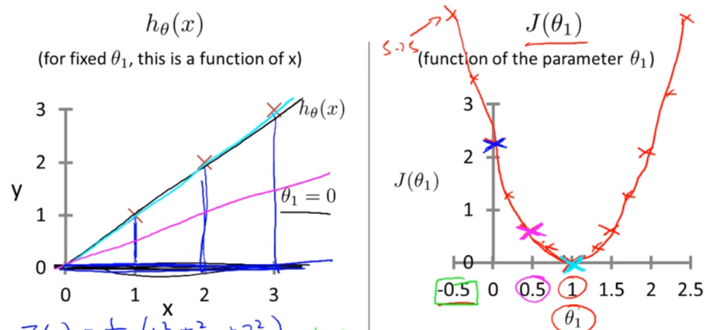
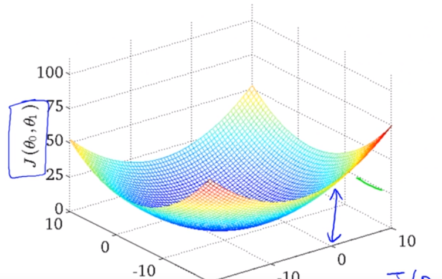
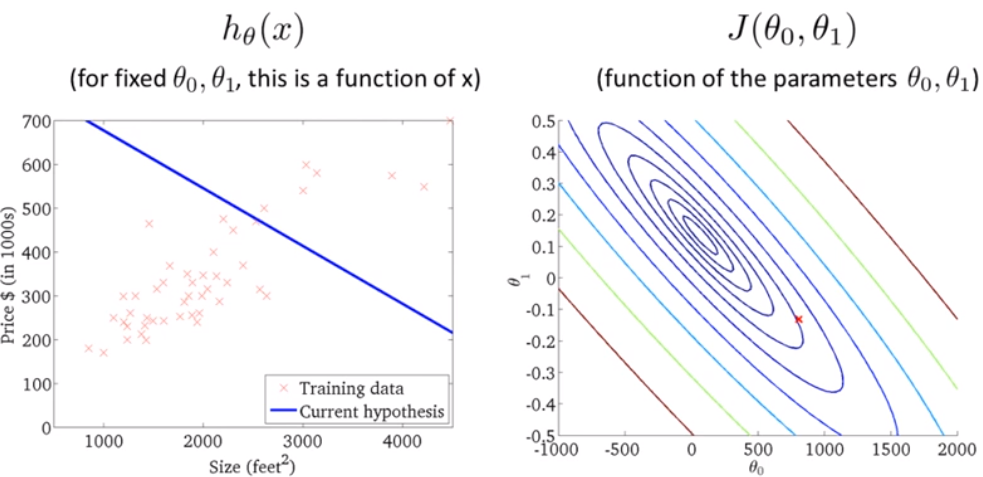
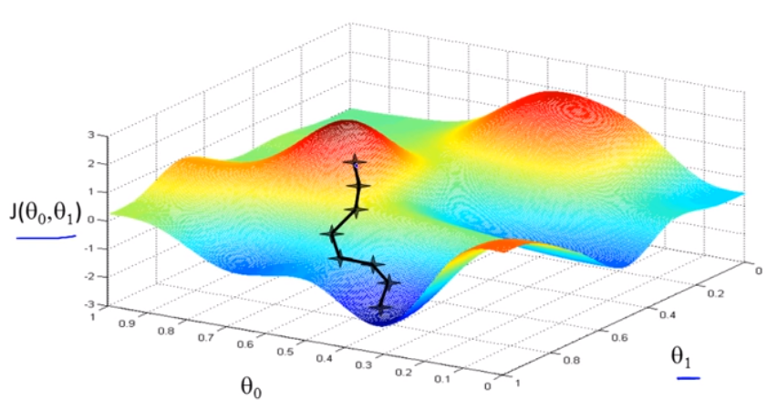
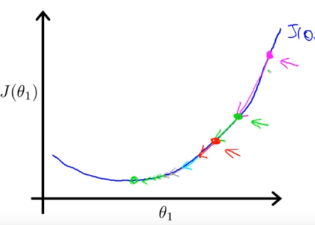
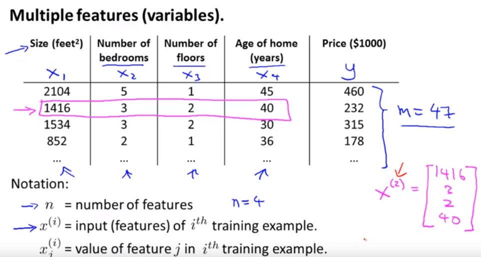
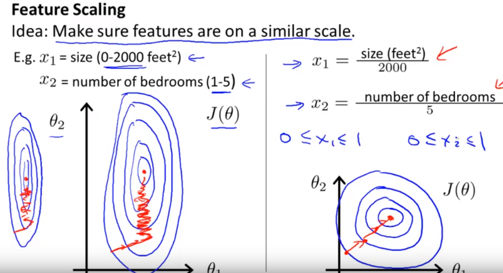
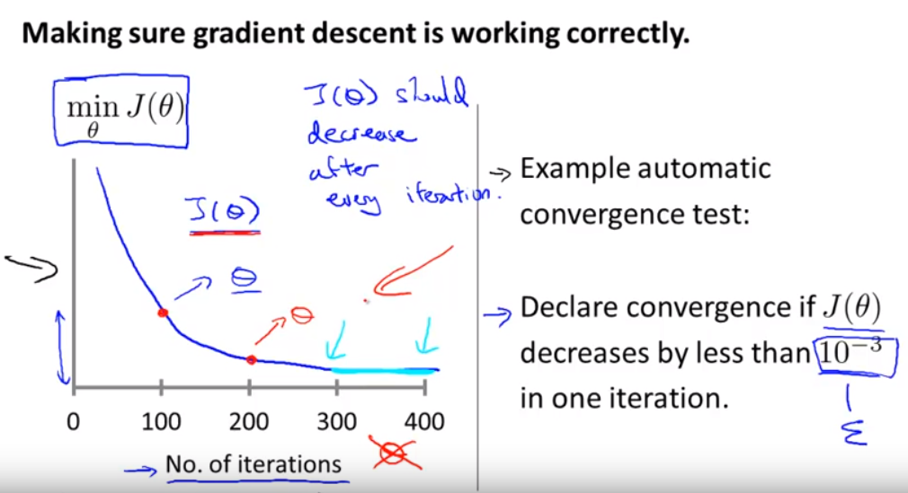
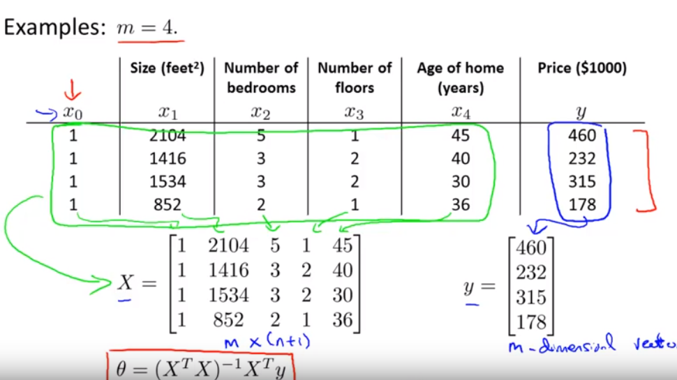

## Linear regression with one variable

### Hypothesis

$$h_{\theta}(x)=\theta_0+\theta_1 x$$

### Parameters

 $$\theta_0, \theta_1$$
 
   

### cost function
$$J(\theta_0, \theta_1)=\frac{1}{2m} \sum^m_{i=1} (h_{\theta}(x^i)-y^i)^2$$

### Goal

$$\min_{\theta_0, \theta_1} \frac{1}{2m} \sum^m_{i=1} (h_{\theta}(x^i)-y^i)^2$$

$$\min_{\theta_0, \theta_1}J(\theta_0, \theta_1)$$

### Now to plot J as contour graph:

### Gradient Descent

- Outline
    - Start with some $$\theta_0, \theta_1$$
    - Keep changing $$\theta_0, \theta_1$$ to reduce $$J(\theta_0, \theta_1)$$ until we hopefully end up at a minimum

#### Algorithm

repeat until convergence:

$$\theta_j:=\theta_j-\alpha \frac{\partial}{\partial \theta_j} J(\theta_0, \theta_1)$$

$$j=0 \: and \: j=1$$

- Notes:
    - Notations
        - `:=`: assignment
        - `=`: truth assertion
    - `alpha: learning rate`
    
    - Simultaneous update

$$\text{temp}_0:=\theta_0-\alpha \frac{\partial}{\partial \theta_0} J(\theta_0, \theta_1)$$

$$\text{temp}_1:=\theta_1-\alpha \frac{\partial}{\partial \theta_1} J(\theta_0, \theta_1)$$

$$\theta_0 := \text{temp}_0$$

$$\theta_1 := \text{temp}_1$$

### (Attention!) As we approach local minimum, gradient descent will automatically take smaller steps. Thus, `No need to decrease alpha over time`

### Linear Regression Model

$$h_{\theta}(x)=\theta_0+\theta_1 x$$

$$J(\theta_0, \theta_1)=\frac{1}{2m} \sum^m_{i=1} (h_{\theta}(x^i)-y^i)^2$$

$$\min_{\theta_0, \theta_1}J(\theta_0, \theta_1)$$

$$\frac{\partial}{\partial \theta_j} J(\theta_0, \theta_1)= \frac{\partial}{\partial \theta_j} \frac{1}{2m} \sum^m_{i=1} (h_{\theta}(x^i)-y^i)^2$$

$$=\frac{\partial}{\partial \theta_j} \frac{1}{2m} \sum^m_{i=1} (\theta_0+\theta_1 x^i-y^i)^2$$

$$\frac{\partial}{\partial \theta_0} J(\theta_0, \theta_1)=\frac{1}{m} \sum^m_{i=1} (h_{\theta}(x^i)-y^i)$$

$$\frac{\partial}{\partial \theta_1} J(\theta_0, \theta_1)= \frac{1}{m} \sum^m_{i=1} (h_{\theta}(x^i)-y^i) \cdot x^i$$

repeat until convergence:

$$\theta_0=\theta_0-\alpha \frac{1}{m} \sum^m_{i=1} (h_{\theta}(x^i)-y^i)$$

$$\theta_1=\theta_1-\alpha \frac{1}{m} \sum^m_{i=1} (h_{\theta}(x^i)-y^i) \cdot x^i$$

update simultaneously

### 'Batch' Gradient Descent

`Batch`: __each step of gradient descent uses all the training examples

## Linear Regression with multiple variables

Example:

### Hypothesis

$$h_{\theta}(x)=\theta_0+\theta_1 x_1 + \theta_2 x_2+ ... + \theta_n x_n$$

$$x=\begin{bmatrix} x_0
\\ x_1
\\ x_2
\\ ...
\\ x_n
\end{bmatrix} \subseteq \mathbb{R}^{n+1}$$

$$\theta=\begin{bmatrix} \theta_0
\\ \theta_1
\\ \theta_2
\\ ...
\\ \theta_n
\end{bmatrix} \subseteq \mathbb{R}^{n+1}$$

$$\theta^T= \begin{bmatrix}
\theta_0 & \theta_1  & \theta_2  & ...  & \theta_n 
\end{bmatrix} $$

$$h_{\theta}(x)=\theta^T x$$

### Parameters

$$\theta_0, \theta_1, \theta_2, ..., \theta_n$$

`Or, can denote as`:

$$\theta, \text{ where here: } \theta \subseteq \mathbb{R}^{n+1}$$

### cost function

$$J(\theta)=J(\theta_0, \theta_1, \theta_2, ..., \theta_n)=\frac{1}{2m} \sum^m_{i=1} (h_{\theta}(x^i)-y^i)^2$$

### Gradient descent

$$\text{   repeat   } \left \{ \theta_j := \theta_j - \alpha \frac{\partial}{\partial \theta_j} J(\theta_0, ..., \theta_n) \right \}$$

$$\theta_0=\theta_0-\alpha \frac{1}{m} \sum^m_{i=1} (h_{\theta}(x^i)-y^i)$$

$$\theta_1=\theta_1-\alpha \frac{1}{m} \sum^m_{i=1} (h_{\theta}(x^i)-y^i) \cdot x^i$$

$$\theta_2=\theta_2-\alpha \frac{1}{m} \sum^m_{i=1} (h_{\theta}(x^i)-y^i) \cdot x^i$$

### Feature Scaling

- Idea: make sure features are on a similar scale

### Get every feature into approximately [-1, 1] range

### Normal equation

