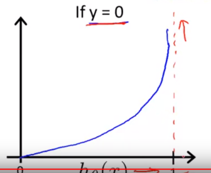

## Logistic Regression

$$h_{\theta}(x)=g(\theta^T x)$$

$$\text{where    }g(z)=\frac{1}{1+e^{-z}}$$

$$\text{thus   } h_{\theta}(x)=\frac{1}{1+e^{-\theta^Tx}}$$

### Interpretation of hypothesis output

$$h_{\theta}(x)=P(y=1 \mid x;\theta)$$

$$\text{probability that } y=1, \text{given } x, \text{parameterized by } \theta$$

$$\text{predict  }y=1 \text{  if  } h_{\theta}(x) \geq 0.5, \text{      which means  } g(\theta^T x) \geq 0.5, \text{  so  } \theta^T x \geq 0$$
$$\text{predict  }y=0 \text{  if  } h_{\theta}(x) \leq 0.5  \text{      which means  } g(\theta^T x) \leq 0.5, \text{  so  } \theta^T x \leq 0$$

### cost function
$$Cost(h_{\theta}(x), y)= \left\{\begin{matrix} -\log (h_{\theta}(x)) \:\: \text{ if } y=1
\\ - \log (1- h_{\theta}(x)) \text{ if } y=0
\end{matrix}\right.$$

#### if y=1

$$Cost=0 \text{  if  } y=1, h_{\theta}(x)=1, h_{\theta}(x) \rightarrow 0 \text{   Cost   } \rightarrow \infty$$

#### if y=0

### Cross-entropy (a more compact way to present the previous cost function)

$$Cost(h_{\theta}(x), y)=- \log (h_{\theta}(x)^{y} (1-h_{\theta}(x))^{1-y})= -y \log (h_{\theta}(x))- (1-y) \log (1-h_{\theta}(x))$$

__thus__

$$Cost(h_{\theta}(x), y)= \left\{\begin{matrix} -\log (h_{\theta}(x)) \:\: \text{ if } y=1
\\ - \log (1- h_{\theta}(x)) \text{ if } y=0
\end{matrix}\right.$$

$$J(\theta)= \frac{1}{m} \sum^m_{i=1} Cost(h_{\theta}(x^i), y)=\frac{1}{m} \sum^m_{i=1} - \log (h_{\theta}(x^i)^{y^i} (1-h_{\theta}(x^i))^{1-y^i})$$

$$ = \frac{1}{m} \sum^m_{i=1} -y^i \log (h_{\theta}(x^i))- (1-y^i) \log (1-h_{\theta}(x^i))$$

$$ \text{To fit parameters   } \theta$$

$$\min_{\theta} J(\theta)$$

$$\text{To make a prediction given new x:   output }h_{\theta}(x)=\frac{1}{1+e^{-\theta ^Tx}}$$

__Gradient Descent__

$$\text{    repeat   } \left \{ \theta_j := \theta - \alpha \frac{\partial}{\partial \theta_j} J(\theta) \right \}$$

$$\text{    repeat   } \left \{ \theta_j := \theta - \alpha \sum^m_{i=1} (h_{\theta}(x^i)-y^i) x_j^i \right \}$$

$$h_{\theta}^i(x)=P(y=i \mid x;\theta) \: (i=1,2,3)$$

$$\text{Train a logistic regression classifier  } h_{\theta}^i(x) \text{    for each class i to predict the prob that  } y=i$$

$$\text{On a new input to-be tested x,to make a prediction, pick the class i which maximizes   } \max_{i} h_{\theta}^i(x)$$

## Regularization for Linear Regression

#### Overfitting: if we have too many features, the learned hypothesis may fit the training set too well, but fail to generalize to new examples:

$$J(\theta)=\frac{1}{2m} \sum^m_{i=1} (h_{\theta}(x^i)-y^i)^2 \approx 0$$

> Solutions?

- Reduce number of features:
    - feature engineering
    - model selection algorithm
- Regularization
    - keep all features, but reduce magnitudes of params (in our case above: theta)
        - work well when there're lots of features, each contributes approximately equally to predicting y 

__After regularization__:

$$J(\theta)=\frac{1}{2m} \left [ \sum ^m _{i=1} (h_{\theta} (x^i) - y^i) ^ 2 + \lambda \sum^{n} _{j=1} \theta_j ^2 \right ] \text{   ridge regularization here?  }$$

- Notes:

$$\text{if } \lambda \text{   set to an extremely large value, say } \lambda = 10^{10} \text{ , then it tends to underfit, vice versa}$$

__GD__:

$$\text{    Repeat   } \left \{ \theta_j := \theta_j - \alpha \left ( \frac{1}{m} \sum^m_{i=1} (h_{\theta}(x^i)-y^i) x_j^i - \frac{\lambda}{m} \theta_j \right ) \right \}$$

$$\theta_j := \theta_j (1- \alpha \frac{\lambda}{m}) - \frac{\alpha}{m} \sum ^m_{i=1} \left ( h_{\theta} (x^i) - y^i \right ) x^i_j$$

__Normal Equation__:

$$\begin{bmatrix}
0 &  & & & \\ 
 & 1 & & & \\
 &  & 1 & & \\ 
 &  & & ... & \\ 
 &  & &  & ... & \\ 
 &  &  & & & 1
\end{bmatrix} \subseteq \mathbb{R}^{n+1}$$

$$\theta = \left (x^T x + \lambda  \begin{bmatrix}
0 &  & & & \\ 
 & 1 & & & \\
 &  & 1 & & \\ 
 &  & & ... & \\ 
 &  & &  & ... & \\ 
 &  &  & & & 1
\end{bmatrix} \right ) ^{-1} x^T y$$

### Attention!!

$$\text{After adding a regularization term, then    }x^T x + \lambda  \begin{bmatrix}
0 &  & & & \\ 
 & 1 & & & \\
 &  & 1 & & \\ 
 &  & & ... & \\ 
 &  & &  & ... & \\ 
 &  &  & & & 1
\end{bmatrix} \text{  is invertible}$$

## Regularization for Logistic Regression

$$ J(\theta)= - \left [ \frac{1}{m} \sum^m_{i=1} y^i \log (h_{\theta}(x^i))+ (1-y^i) \log (1-h_{\theta}(x^i)) \right ] + \frac{\lambda}{2m} \sum^{n}_{j=1} \theta_j^2$$

$$\text{    Repeat   } \left \{ \theta_j := \theta_j - \alpha \left ( \frac{1}{m} \sum^m_{i=1} (h_{\theta}(x^i)-y^i) x_j^i - \frac{\lambda}{m} \theta_j \right ) \right \}$$

$$\text{the difference from above is: for here   } h_{\theta}(x)=\frac{1}{1+e^{-\theta^Tx}}$$

$$\frac{\partial}{\partial \theta_0} J(\theta)= \frac{1}{m} \sum^m_{i=1} (h_{\theta}(x^i)-y^i) x_0^i$$

$$\frac{\partial}{\partial \theta_1} J(\theta)= \frac{1}{m} \sum^m_{i=1} (h_{\theta}(x^i)-y^i) x_1^i - \frac{\lambda}{m} \theta_1$$

$$\frac{\partial}{\partial \theta_2} J(\theta)= \frac{1}{m} \sum^m_{i=1} (h_{\theta}(x^i)-y^i) x_2^i - \frac{\lambda}{m} \theta_2$$

$$\text{.....}$$

$$\frac{\partial}{\partial \theta_n} J(\theta)= \frac{1}{m} \sum^m_{i=1} (h_{\theta}(x^i)-y^i) x_n^i - \frac{\lambda}{m} \theta_n$$
