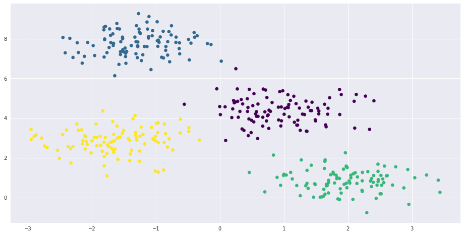

# t-SNE, PCA, HBSCAN toy sample


```python
%matplotlib inline
import matplotlib as mpl
from mpl_toolkits.mplot3d import Axes3D
import numpy as np
import matplotlib.cm as cm
import matplotlib.pyplot as plt
import pandas as pd
import hdbscan
plt_style = 'seaborn-talk'
```


```python
from sklearn.decomposition import PCA
from sklearn.manifold import TSNE, Isomap, LocallyLinearEmbedding, MDS, SpectralEmbedding
from sklearn.preprocessing import StandardScaler
```

## Generate the data
Generate some Gaussian points for testing:


```python
num_dimensions = 3
num_clusters = 4
num_points = 100
cluster_separation = 6

centers = np.array([(0,0,0), (1,0,0), (0,1,0), (0,0,1)], dtype=float) * cluster_separation

data = np.zeros((num_clusters * num_points, num_dimensions), dtype=float)
labels = np.zeros(num_clusters * num_points, dtype=int)
data.shape
```


    (400, 3)


```python
labels.shape
```


    (400,)


```python
for c in range(num_clusters):
    start = c * num_points
    end = start + num_points
    data[start:end, :] = np.random.randn(num_points, num_dimensions) + centers[c]
    labels[start:end] = c
    
data_df = pd.DataFrame(data, columns=('x','y','z'))
data_df['label'] = labels
data_df.head()
```


<div>
<table border="1" class="dataframe">
  <thead>
    <tr style="text-align: right;">
      <th></th>
      <th>x</th>
      <th>y</th>
      <th>z</th>
      <th>label</th>
    </tr>
  </thead>
  <tbody>
    <tr>
      <th>0</th>
      <td>-0.720824</td>
      <td>0.353444</td>
      <td>-1.581030</td>
      <td>0</td>
    </tr>
    <tr>
      <th>1</th>
      <td>-0.233930</td>
      <td>1.266216</td>
      <td>0.731135</td>
      <td>0</td>
    </tr>
    <tr>
      <th>2</th>
      <td>-0.018812</td>
      <td>1.325164</td>
      <td>-0.462638</td>
      <td>0</td>
    </tr>
    <tr>
      <th>3</th>
      <td>0.325181</td>
      <td>0.261413</td>
      <td>-0.306655</td>
      <td>0</td>
    </tr>
    <tr>
      <th>4</th>
      <td>-0.706767</td>
      <td>-0.200486</td>
      <td>0.567257</td>
      <td>0</td>
    </tr>
  </tbody>
</table>
</div>


## data preprocessing (mostly normalization)


```python
X = data_df.ix[:,0:-1] # remove labels column
X.head()
```


<div>
<table border="1" class="dataframe">
  <thead>
    <tr style="text-align: right;">
      <th></th>
      <th>x</th>
      <th>y</th>
      <th>z</th>
    </tr>
  </thead>
  <tbody>
    <tr>
      <th>0</th>
      <td>-0.720824</td>
      <td>0.353444</td>
      <td>-1.581030</td>
    </tr>
    <tr>
      <th>1</th>
      <td>-0.233930</td>
      <td>1.266216</td>
      <td>0.731135</td>
    </tr>
    <tr>
      <th>2</th>
      <td>-0.018812</td>
      <td>1.325164</td>
      <td>-0.462638</td>
    </tr>
    <tr>
      <th>3</th>
      <td>0.325181</td>
      <td>0.261413</td>
      <td>-0.306655</td>
    </tr>
    <tr>
      <th>4</th>
      <td>-0.706767</td>
      <td>-0.200486</td>
      <td>0.567257</td>
    </tr>
  </tbody>
</table>
</div>


```python
X_std = StandardScaler().fit_transform(X)
X_std[:10]
```


    array([[-0.79085977, -0.40320432, -1.10842369],
           [-0.61709777, -0.0787638 , -0.29607557],
           [-0.54032692, -0.05781097, -0.71549151],
           [-0.41756338, -0.43591632, -0.66068922],
           [-0.78584321, -0.60009628, -0.35365182],
           [-0.49783576, -1.08269097, -0.83537089],
           [-0.4372242 , -0.395531  , -0.79655913],
           [-0.72718628, -0.31763448, -0.57244247],
           [-0.54298361, -0.5844295 , -0.46191725],
           [-0.2395936 , -0.85422423, -0.5455048 ]])


```python
y = data_df['label'].values
y
```


    array([0, 0, 0, 0, 0, 0, 0, 0, 0, 0, 0, 0, 0, 0, 0, 0, 0, 0, 0, 0, 0, 0, 0,
           0, 0, 0, 0, 0, 0, 0, 0, 0, 0, 0, 0, 0, 0, 0, 0, 0, 0, 0, 0, 0, 0, 0,
           0, 0, 0, 0, 0, 0, 0, 0, 0, 0, 0, 0, 0, 0, 0, 0, 0, 0, 0, 0, 0, 0, 0,
           0, 0, 0, 0, 0, 0, 0, 0, 0, 0, 0, 0, 0, 0, 0, 0, 0, 0, 0, 0, 0, 0, 0,
           0, 0, 0, 0, 0, 0, 0, 0, 1, 1, 1, 1, 1, 1, 1, 1, 1, 1, 1, 1, 1, 1, 1,
           1, 1, 1, 1, 1, 1, 1, 1, 1, 1, 1, 1, 1, 1, 1, 1, 1, 1, 1, 1, 1, 1, 1,
           1, 1, 1, 1, 1, 1, 1, 1, 1, 1, 1, 1, 1, 1, 1, 1, 1, 1, 1, 1, 1, 1, 1,
           1, 1, 1, 1, 1, 1, 1, 1, 1, 1, 1, 1, 1, 1, 1, 1, 1, 1, 1, 1, 1, 1, 1,
           1, 1, 1, 1, 1, 1, 1, 1, 1, 1, 1, 1, 1, 1, 1, 1, 2, 2, 2, 2, 2, 2, 2,
           2, 2, 2, 2, 2, 2, 2, 2, 2, 2, 2, 2, 2, 2, 2, 2, 2, 2, 2, 2, 2, 2, 2,
           2, 2, 2, 2, 2, 2, 2, 2, 2, 2, 2, 2, 2, 2, 2, 2, 2, 2, 2, 2, 2, 2, 2,
           2, 2, 2, 2, 2, 2, 2, 2, 2, 2, 2, 2, 2, 2, 2, 2, 2, 2, 2, 2, 2, 2, 2,
           2, 2, 2, 2, 2, 2, 2, 2, 2, 2, 2, 2, 2, 2, 2, 2, 2, 2, 2, 2, 2, 2, 2,
           2, 3, 3, 3, 3, 3, 3, 3, 3, 3, 3, 3, 3, 3, 3, 3, 3, 3, 3, 3, 3, 3, 3,
           3, 3, 3, 3, 3, 3, 3, 3, 3, 3, 3, 3, 3, 3, 3, 3, 3, 3, 3, 3, 3, 3, 3,
           3, 3, 3, 3, 3, 3, 3, 3, 3, 3, 3, 3, 3, 3, 3, 3, 3, 3, 3, 3, 3, 3, 3,
           3, 3, 3, 3, 3, 3, 3, 3, 3, 3, 3, 3, 3, 3, 3, 3, 3, 3, 3, 3, 3, 3, 3,
           3, 3, 3, 3, 3, 3, 3, 3, 3])


```python
def plot(data, title, labels=y):
    dimension = data.shape[1]
    label_types = sorted(list(set(labels))) # np.unique
    num_labels = len(label_types)
    colors = cm.Accent(np.linspace(0, 1, num_labels))
    
    with plt.style.context(plt_style):
        
        fig = plt.figure()
        
        if dimension == 2:
            ax = fig.add_subplot(111)
            for lab, col in zip(label_types, colors):
                ax.scatter(data[labels==lab, 0],
                           data[labels==lab, 1],
                           c=col)
        elif dimension == 3:
            ax = fig.add_subplot(111, projection='3d')
            for lab, col in zip(label_types, colors):
                ax.scatter(data[labels==lab, 0],
                           data[labels==lab, 1],
                           data[labels==lab, 2],
                           c=col)
        else:
            raise Exception('Unknown dimension: %d' % dimension)
        plt.title(title)
        plt.show()
```

## 3D view


```python
plot(X.values, 'Original Data')
```





```python
plot(X.values[:,1:], 'Plane $x=0$') # assume x=0, thus remove column one [:, 1:]
```


## PCA (2D)


```python
plot(PCA(n_components=3).fit_transform(X), 'PCA') # num_clusters = 4
```


## Isomap


```python
plot(Isomap(n_components=3).fit_transform(X), 'Isomap')
```


## LocallyLinearEmbedding


```python
plot(LocallyLinearEmbedding(n_components=3).fit_transform(X), 'Locally Linear Embedding')
```


## Spectral Embedding


```python
plot(SpectralEmbedding(n_components=3).fit_transform(X), 'Spectral Embedding')
```


## Multi-dimensional scaling (MDS)


```python
plot(MDS(n_components=3).fit_transform(X), 'Multi-dimensional Scaling')
```


## PCA (3D)


```python
plot(PCA(n_components=3).fit_transform(X), 'PCA')
```


## t-SNE (3D)


```python
tsne3 = TSNE(n_components=3, learning_rate=100, random_state=0)
plot(tsne3.fit_transform(X), 't-SNE')
```


## HDBScan
HDBScan is a fairly recent and well-regarded clustering algorithm. The reason it's here is to see how well it does on some fairly simple data and visualize its results via t-SNE.


```python
clusterer = hdbscan.HDBSCAN(min_cluster_size=20)
cluster_labels = clusterer.fit_predict(X_std) + 1
plot(tsne3.fit_transform(X), 'HDBScan', labels=cluster_labels)
```


